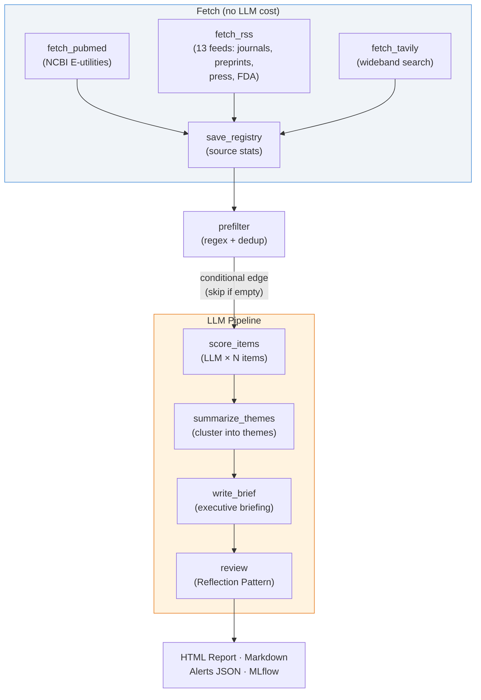

# NeuroTech Newshound

An **agentic AI research analyst** that monitors the NeuroTech ecosystem — implantable BCIs, ECoG/sEEG, microstimulation, enabling materials — and produces weekly intelligence briefings with LLM-scored relevance, thematic synthesis, and a reflection-based quality review.

Built with [LangGraph](https://github.com/langchain-ai/langgraph). Deployed on [OpenClaw](https://openclaw.ai/). Developed locally in [Cursor](https://cursor.com/).

---

## What This Project Does

Each week, the agent:

1. **Fetches** from 15 sources — PubMed, journal RSS feeds (Nature Neuroscience, J Neural Engineering, Neuron, ...), preprint servers (bioRxiv, medRxiv, arXiv), general press (NYT, FT, STAT News), FDA MedWatch, and Tavily wideband search
2. **Pre-filters** with domain-specific regex patterns (fast, free, deterministic)
3. **Deduplicates** against a history of previously-scored items — skips confirmed low-value repeats, re-evaluates high-value items
4. **Scores** each candidate with an LLM that understands neuroscience — assessing relevance, categorizing, and flagging vaporware
5. **Clusters** scored items into 2–5 themes with significance ratings
6. **Writes** an executive brief (TL;DR, themes, alerts, what-to-watch)
7. **Reviews** the brief via a Reflection Pattern — a reviewer LLM critiques the analysis and adjusts scores
8. **Produces** a polished HTML report, markdown report, alerts JSON, and full results JSON
9. **Logs** to MLflow — parameters, token/cost metrics, per-source yield, and report artifacts

The entire pipeline runs in ~3 minutes and costs ~$0.008 per run with `gpt-4o-mini`.

---

## Architecture



### Design Patterns

- **Two-Stage Scoring**: Regex pre-filter (free, ~300 → ~50 items) followed by LLM assessment with domain-aware judgment. Keeps costs near-zero while leveraging LLM reasoning where it matters.
- **Deduplication**: Hash-based history tracks every scored item. Items scored < 7 in prior runs are skipped (confirmed low-value). Items ≥ 7 are re-evaluated (things evolve — a preprint becomes a publication, a trial advances).
- **Reflection Pattern**: The reviewer node critiques the executive brief, checks calibration of significance ratings, flags missed connections, and calls out vaporware — mimicking a PI reviewing a research associate's work.
- **Source Registry**: JSON-persisted registry tracks per-source yield stats (items fetched, in-scope count, last hit date). Supports auto-discovery of new sources via Tavily and cold-source pruning.
- **Conditional Edge**: If nothing passes the regex pre-filter (quiet week), the LLM pipeline is skipped entirely. No API cost on empty weeks.
- **Multi-Model Routing**: Different LLMs for analysis vs. review (e.g., `gpt-4o-mini` for bulk scoring, `gpt-4o` for critical review). Configurable via CLI or environment variables.

---

## Sample Output

From a real run (2026-02-16, 7-day lookback, 15 sources):

| Metric | Value |
|--------|-------|
| Raw items fetched | 293 |
| Sources active | 15 |
| After regex pre-filter | 53 |
| LLM-scored items | 53 |
| Priority alerts (9–10) | 6 |
| Themes identified | 4 (1 breakthrough) |
| LLM calls | 56 |
| Total tokens | 36,115 |
| Cost | $0.008 |
| Duration | ~3 min |

**Alerts detected** (from Tavily wideband — not in any curated RSS feed):
- *"Neuralink competitor Paradromics completes first human brain implant"* — score 9 (implantable_bci)
- *"Brain-Computer Interface Clinical Trials - Johns Hopkins Medicine"* — score 9 (implantable_bci)
- *"Precision Neuroscience receives FDA clearance for brain implant"* — score 9 (regulatory)

**Theme: "Advancements in Implantable BCIs"** — rated **breakthrough** (11 items from PubMed, Tavily, STAT News).

The LLM correctly distinguished `ECOG` (oncology performance status) from `ECoG` (electrocorticography) — scoring the former as 1/out_of_scope and the latter as 7-8/ecog_seeg.

---

## Project Structure

```
neurotech_newshound/
├── workspace/                         # 1:1 mirror of OpenClaw workspace
│   ├── SOUL.md                        # Agent identity & mission
│   ├── skills/
│   │   └── neuro_hound/
│   │       ├── SKILL.md               # Skill contract
│   │       ├── run.py                 # CLI entry point
│   │       ├── state.py               # HoundState TypedDict
│   │       ├── graph.py               # LangGraph StateGraph definition
│   │       ├── requirements.txt       # Python dependencies
│   │       ├── nodes/                 # Graph nodes (one file per node)
│   │       │   ├── fetch.py           #   PubMed + RSS + Tavily fetchers
│   │       │   ├── prefilter.py       #   Regex pre-filter + dedup
│   │       │   ├── score.py           #   LLM per-item scoring
│   │       │   ├── summarize.py       #   Theme clustering + executive brief
│   │       │   └── review.py          #   Reflection + dedup history update
│   │       └── tools/                 # Shared utilities
│   │           ├── http.py            #   HTTP + SSL helper
│   │           ├── pubmed.py          #   PubMed E-utilities client
│   │           ├── rss.py             #   Registry-driven RSS/Atom parser
│   │           ├── tavily.py          #   Tavily wideband search
│   │           ├── sources.py         #   Source registry (JSON persistence)
│   │           ├── scoring.py         #   Regex scoring patterns
│   │           ├── dedup.py           #   Deduplication history
│   │           ├── llm.py             #   LLM factory + usage tracker
│   │           ├── html_report.py     #   HTML report generator
│   │           └── mlflow_tracker.py  #   MLflow experiment logging
│   └── archives/neurotech/            # Reports land here (on droplet)
├── dev/
│   ├── test_run.py                    # Local test runner
│   └── sample_output/                 # Local test output (gitignored)
├── scripts/
│   ├── deploy.sh                      # rsync workspace → droplet
│   └── fetch_reports.sh               # rsync reports ← droplet
├── .env.example
├── .gitignore
└── README.md
```

---

## Data Sources

### Curated (15 sources)

| Category | Sources |
|----------|---------|
| **Database** | [PubMed](https://pubmed.ncbi.nlm.nih.gov/) (NCBI E-utilities) |
| **Journals** | Nature Neuroscience, Nature Biomedical Engineering, J Neural Engineering, Neuron, Science Robotics |
| **Preprints** | [bioRxiv](https://www.biorxiv.org/) (neuroscience), [medRxiv](https://www.medrxiv.org/), [arXiv](https://arxiv.org/) q-bio.NC |
| **Press** | NYT Science, NYT Health, FT Technology, [STAT News](https://www.statnews.com/) |
| **Regulatory** | [FDA MedWatch](https://www.fda.gov/safety/medwatch-fda-safety-information-and-adverse-event-reporting-program) |
| **Search** | [Tavily](https://tavily.com/) wideband (5 neurotech queries) |

### Auto-Discovery

Tavily results are analyzed for domains that yield multiple high-scoring items. These can be proposed as new curated sources. The registry caps at 40 sources and prunes cold (30-day no-hit) discovered sources automatically.

All data sources except Tavily and LLMs are free and require no API keys.

---

## Scoring

### Three-Stage Pipeline

**Stage 1 — Regex Pre-filter** (free, deterministic):
Broad pattern matching keeps items mentioning BCIs, ECoG, sEEG, intracortical recording, microstimulation, etc. Removes obvious non-matches before any API calls.

**Stage 2 — Deduplication** (free, history-based):
Items previously scored < 7 are skipped. Items ≥ 7 are re-evaluated. First-time items always scored.

**Stage 3 — LLM Scoring** (per-item, domain-aware):
Each remaining item gets an individual LLM call with a neuroscience-specific prompt. The LLM returns a score, category, assessment, and vaporware flag.

| Score | Meaning | Examples |
|-------|---------|----------|
| **9–10** | Priority alert | First-in-human implant, FDA IDE/PMA/De Novo, pivotal trial |
| **7–8** | High signal | ECoG/sEEG recording study, single-unit data, closed-loop BCI |
| **5–6** | Moderate | Materials/biocompatibility, animal BCI, neural decoding methods |
| **3–4** | Low | Tangentially related neuroscience |
| **1–2** | Out of scope | Scalp EEG wearables, oncology, marketing |

### Categories

`implantable_bci` · `ecog_seeg` · `stimulation` · `materials` · `regulatory` · `funding` · `animal_study` · `methods` · `out_of_scope`

---

## Quick Start

### Prerequisites

- Python 3.11+
- An [OpenAI](https://platform.openai.com/) API key (for `gpt-4o-mini`). Gemini and Claude also supported.
- Optional: [Tavily](https://tavily.com/) API key (for wideband search)

### Setup

```bash
git clone https://github.com/kgrajski/neurotech_newshound.git
cd neurotech_newshound

pip install -r workspace/skills/neuro_hound/requirements.txt
cp .env.example .env
# Edit .env with your API key(s)
```

### Run Locally

```bash
# Full pipeline (LLM scoring + synthesis + reflection)
python dev/test_run.py --days 7

# Phase 1 only (regex scoring, no LLM cost)
python dev/test_run.py --phase1-only --days 7

# With a specific model
python dev/test_run.py --days 7 --model gpt-4o
```

Output goes to `dev/sample_output/`:
- `YYYY-MM-DD.html` — Polished HTML intelligence briefing
- `YYYY-MM-DD.md` — Markdown report with executive brief
- `YYYY-MM-DD.alerts.json` — Priority items (score 9–10)
- `YYYY-MM-DD.full.json` — Machine-readable results + usage metrics

### View MLflow Results

```bash
mlflow ui --port 5000
# Open http://127.0.0.1:5000
```

### Deploy to OpenClaw Droplet

```bash
# Push code to droplet
bash scripts/deploy.sh

# Run on droplet (via SSH or OpenClaw chat)
ssh root@your-droplet
cd ~/.openclaw/workspace
python3 skills/neuro_hound/run.py --days 7

# Fetch reports back locally
bash scripts/fetch_reports.sh
```

---

## Technologies

| Layer | Technologies |
|-------|-------------|
| **Agentic AI** | LangGraph, LangChain |
| **LLMs** | GPT-4o-mini (default), GPT-4o, Gemini 2.0 Flash, Claude (multi-model routing) |
| **Data Sources** | PubMed E-utilities, RSS/Atom (13 feeds), Tavily Search |
| **NLP** | Regex pre-filter, LLM-based domain scoring, deduplication |
| **Observability** | MLflow (params, metrics, artifacts per run) |
| **Output** | HTML report, Markdown, JSON, MLflow artifacts |
| **Deployment** | OpenClaw, rsync, Digital Ocean |
| **Development** | Cursor IDE, Python 3.11+, python-dotenv |

---

## Evolution

| Phase | What | Status |
|-------|------|--------|
| **1** | Pure Python: PubMed + RSS fetch, regex scoring, markdown report | Done |
| **2** | LangGraph pipeline: LLM scoring, thematic synthesis, executive brief, reflection | Done |
| **3** | Source expansion: 15 sources (journals, press, FDA, Tavily wideband search) | Done |
| **4** | HTML report, MLflow observability, deduplication | **Done** |
| 5 | Auto-publish to [nurosci.com](https://nurosci.com) | Planned |

This project shares design patterns with [trading_etf](https://github.com/kgrajski/trading_etf), an ETF trading system with an agentic AI analyst — same LangGraph architecture, Reflection Pattern, and multi-model routing approach applied to a different domain.

---

## License

MIT
