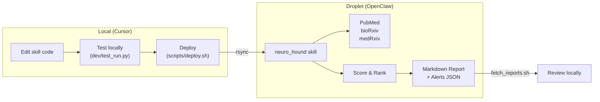

# NeuroTech Newshound

An autonomous research agent that monitors the NeuroTech ecosystem — implantable BCIs, ECoG/sEEG, microstimulation, enabling materials — and produces weekly ranked briefings.

Deployed on [OpenClaw](https://openclaw.ai/), developed locally in Cursor.

## Architecture



## Current Phase: Phase 1 (MVP)

| Phase | What | Status |
|-------|------|--------|
| **1** | Pure Python: PubMed + RSS fetch, regex scoring, markdown report | **Active** |
| 2 | Add LangGraph: LLM thematic summarization + reflection pattern | Planned |
| 3 | Add MLflow: Run metrics, cost tracking, artifact logging | Planned |

## Project Structure

```
neurotech_newshound/
├── workspace/                     # 1:1 mirror of OpenClaw workspace
│   ├── SOUL.md                    # Agent identity & mission
│   ├── skills/
│   │   └── neuro_hound/
│   │       ├── SKILL.md           # Skill contract
│   │       └── run.py             # Skill implementation
│   └── archives/neurotech/        # Reports land here (on droplet)
├── dev/
│   ├── test_run.py                # Local test runner
│   └── sample_output/             # Local test output
├── scripts/
│   ├── deploy.sh                  # rsync workspace → droplet
│   └── fetch_reports.sh           # rsync reports ← droplet
├── docs/
├── .env.example
└── README.md
```

## Quick Start

### 1. Configure

```bash
cp .env.example .env
# Edit .env with your droplet IP
```

### 2. Test Locally

```bash
python dev/test_run.py --days 7
# Output goes to dev/sample_output/
```

### 3. Deploy to Droplet

```bash
bash scripts/deploy.sh
```

### 4. Run on Droplet (via OpenClaw chat or SSH)

```bash
# Via SSH:
ssh root@your-droplet
cd ~/.openclaw/workspace
python3 skills/neuro_hound/run.py --days 7

# Via OpenClaw chat:
# "Run neuro hound for the last 7 days"
```

### 5. Fetch Reports Back

```bash
bash scripts/fetch_reports.sh
# Reports appear in workspace/archives/neurotech/
```

## Sources

| Source | Type | API Key Required |
|--------|------|:---:|
| PubMed (NCBI E-utilities) | Peer-reviewed articles | No |
| bioRxiv | Neuroscience preprints | No |
| medRxiv | Clinical preprints | No |

## Scoring

Items are scored 1–10 based on domain-specific patterns:

| Score | Meaning |
|-------|---------|
| **9–10** | Priority alert: first-in-human, FDA milestone, pivotal trial (strict scope gate) |
| **7–8** | High signal: ECoG/sEEG, single-unit recording, microstimulation, closed-loop |
| **5–6** | Moderate: materials, biocompatibility, general BCI |
| **3–4** | Low: tangentially related |
| **1–2** | Demoted: wearables, marketing, out-of-scope |

## License

MIT
