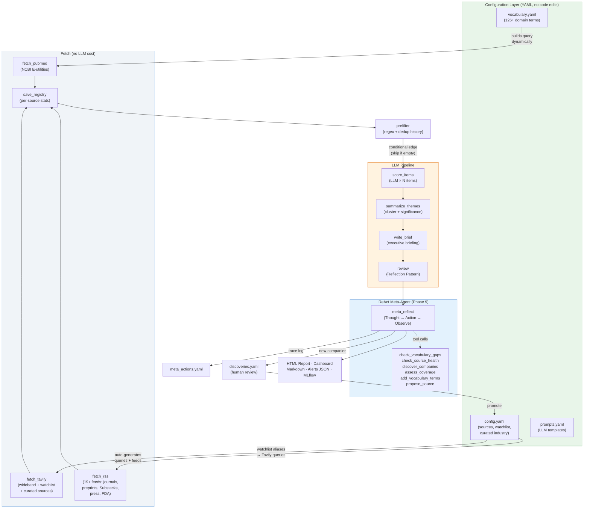
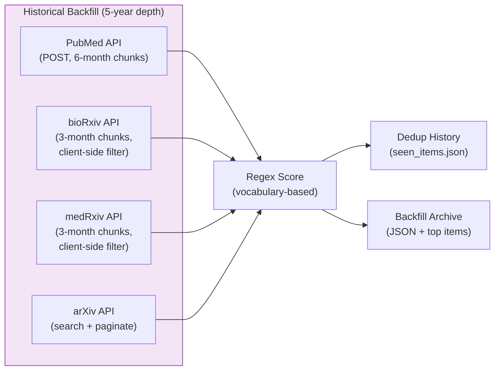

# NeuroTech NewsHound

An **agentic AI research analyst** that monitors the NeuroTech ecosystem — implantable BCIs, ECoG/sEEG, microstimulation, enabling materials — and produces weekly intelligence briefings with LLM-scored relevance, thematic synthesis, and a reflection-based quality review.

Built with [LangGraph](https://github.com/langchain-ai/langgraph). Deployed on [OpenClaw](https://openclaw.ai/). Developed locally in [Cursor](https://cursor.com/).

---

## Agentic AI — A Quick Glossary

If you're new to agentic AI or just want a refresher, here's a cheat sheet for the key concepts used in this project. Each term links to where it lives in the codebase.

| Term | What It Is | Plain-English Analogy |
|------|-----------|----------------------|
| **Agent** | A program that uses an LLM to make decisions within a structured workflow — not just generate text, but _act_ (fetch data, score items, write reports). | A research analyst who follows a process but uses judgment at each step. |
| [**SOUL.md**](workspace/SOUL.md) | Defines the agent's _identity_ — its name, domain focus, values, and boundaries. Short and stable. Think "who am I?" | A job description's mission statement. |
| [**SKILL.md**](workspace/skills/neuro_hound/SKILL.md) | The complete _operational specification_ — goals, tools, workflow, scoring criteria, constraints. Think "how do I do my job?" | A detailed SOP (Standard Operating Procedure). |
| [**config.yaml**](workspace/skills/neuro_hound/config.yaml) | Runtime settings a user edits without touching code — sources, models, company watchlist, Tavily queries. | The knobs and dials on a control panel. |
| [**prompts.yaml**](workspace/skills/neuro_hound/prompts.yaml) | All LLM prompt templates in one file. Edit to change _how_ the LLM reasons, without changing _what_ the pipeline does. | The instructions you'd give a new hire. |
| [**vocabulary.yaml**](workspace/skills/neuro_hound/vocabulary.yaml) | Domain vocabulary (126+ terms) used to dynamically construct PubMed queries and regex filters. Grows as new papers are processed. | A specialist's glossary that expands with experience. |
| **Tool** | A Python module that does one thing — fetch from PubMed, search Tavily, score with regex, load config. Tools live in `tools/`. | Individual instruments in a lab. |
| **Node** | A step in the workflow graph — each node calls one or more tools, updates the shared state, and passes control to the next node. Nodes live in `nodes/`. | A station on an assembly line. |
| **State** | A typed Python dict (`HoundState`) that flows through the graph. Each node reads from it and writes to it. | A clipboard passed from station to station. |
| **[LangGraph](https://github.com/langchain-ai/langgraph)** | The framework that wires nodes into a directed graph with conditional edges (e.g., "skip LLM if nothing passed regex"). | The conveyor belt connecting the stations. |
| **Reflection Pattern** | A second LLM call that _critiques_ the first LLM's output — checking calibration, spotting missed connections, flagging vaporware. | A senior reviewer reading a junior analyst's draft. |
| **ReAct Pattern** | A multi-turn loop where the LLM _reasons_ (Thought), _acts_ (calls a tool), and _observes_ the result — then decides what to do next. The agent, not the code, chooses which tools to use. | A researcher who checks their work, notices a gap, looks something up, and decides whether to keep going. |
| **Meta-Tools** | Functions the ReAct meta-agent can call — check vocabulary gaps, assess source health, discover companies, evaluate coverage. Defined in `tools/meta_tools.py`. | The reference books and checklists the researcher reaches for. |
| **[MLflow](https://mlflow.org/)** | Experiment tracker that logs every run — parameters, token costs, artifacts. Lets you compare runs over time. | A lab notebook that records every experiment. |

> **Why so many files?** Each layer has one job: SOUL.md says _who_, SKILL.md says _how_, config.yaml says _what to monitor_, prompts.yaml says _what to ask the LLM_, and vocabulary.yaml says _what terms to search for_. This separation means you can change the search vocabulary without editing code, or swap the LLM model without touching prompts. See [ADR-001](docs/ADR-001-agent-specification.md) for the full rationale.

---

## What This Project Does

Each week, the agent:

1. **Fetches** from 23+ sources — PubMed, journal RSS feeds (Nature, Nature Neuroscience, Science, Lancet Neurology, Neuron, NEJM, IEEE TNSRE, ...), preprint servers (bioRxiv, medRxiv, arXiv), company Substacks (auto-injected from watchlist), general press (NYT, FT, STAT News), FDA MedWatch, and Tavily wideband search (with auto-generated queries from a company watchlist of 11 BCI companies)
2. **Pre-filters** with domain-specific regex patterns built from a 126-term domain vocabulary (fast, free, deterministic)
3. **Deduplicates** against a history of previously-scored items — skips confirmed low-value repeats, re-evaluates high-value items
4. **Scores** each candidate with an LLM that understands neuroscience — assessing relevance, categorizing, and flagging vaporware
5. **Clusters** scored items into 2–5 themes with significance ratings
6. **Writes** an executive brief (TL;DR, themes, alerts, what-to-watch)
7. **Reviews** the brief via a Reflection Pattern — a reviewer LLM critiques the analysis and adjusts scores
8. **Meta-reflects** using a ReAct agent that reasons about the pipeline's output and decides which self-improvement actions to take — checking vocabulary gaps, source health, coverage blind spots, and discovering new companies. The LLM chooses which tools to call (or none, on a quiet week).
9. **Produces** a polished HTML report, operational dashboard, markdown report, alerts JSON, meta-agent trace, and full results JSON
10. **Logs** to MLflow — parameters, token/cost metrics, per-source yield, and report artifacts

All sources, models, and behavior are configured via YAML files (`config.yaml`, `prompts.yaml`, `vocabulary.yaml`) — no code edits needed to add sources, change models, update prompts, or expand search vocabulary.

The weekly pipeline runs in ~2.5 minutes and costs ~$0.009 per run with `gpt-4o-mini`. A separate **backfill mode** fetches 5 years of historical data from PubMed, bioRxiv, medRxiv, and arXiv using their archival APIs.

---

## Architecture

The system has two operating modes: a **weekly pipeline** that monitors current activity across 23+ sources, and a **backfill mode** that builds historical depth from archival APIs (PubMed, bioRxiv, medRxiv, arXiv). Both modes feed the same dedup history and source registry.

### Weekly Pipeline



### Backfill Mode (Phase 8)



### Design Patterns

- **Config-Driven Sources**: All 23+ sources defined in `config.yaml`. Add a journal by adding 4 lines of YAML — no code changes needed.
- **Adaptive Source Management**: The company watchlist auto-generates Tavily queries from aliases and injects Substack RSS feeds. The ReAct meta-agent can discover new companies, flag cold sources, and propose new feeds.
- **ReAct Meta-Reflection**: After the pipeline completes, a genuine ReAct agent receives the output and decides which self-improvement tools to invoke — vocabulary gap detection, source health checks, company discovery, coverage assessment. The LLM reasons about *whether* to act (not a fixed code path). Trace logged to `meta_actions.yaml`.
- **Dynamic Query Construction**: PubMed queries are built at runtime from `vocabulary.yaml` (126+ domain terms extracted from representative papers). The vocabulary grows as new papers are processed and self-stabilizes as domain terminology is finite.
- **Two-Stage Scoring**: Regex pre-filter (free, ~485 → ~56 items) followed by LLM assessment with domain-aware judgment. Keeps costs near-zero while leveraging LLM reasoning where it matters.
- **Deduplication**: Hash-based history tracks every scored item. Items scored < 7 in prior runs are skipped (confirmed low-value). Items ≥ 7 are re-evaluated (things evolve — a preprint becomes a publication, a trial advances).
- **Reflection Pattern**: The reviewer node critiques the executive brief, checks calibration of significance ratings, flags missed connections, and calls out vaporware — mimicking a PI reviewing a research associate's work. (Company discovery has moved to the ReAct meta-agent.)
- **Source Registry**: JSON-persisted registry tracks per-source yield stats (items fetched, in-scope count, last hit date). Supports auto-discovery of new sources via Tavily and cold-source pruning.
- **Historical Backfill**: Separate entry point (`backfill.py`) fetches 5 years of archival data from PubMed, bioRxiv, medRxiv, and arXiv using their APIs (RSS feeds are current-only). Regex-scored and stored in the dedup history for future runs.
- **Conditional Edge**: If nothing passes the regex pre-filter (quiet week), the LLM pipeline is skipped entirely. No API cost on empty weeks.
- **Multi-Model Routing**: Different LLMs for analysis vs. review (e.g., `gpt-4o-mini` for bulk scoring, `gpt-4o` for critical review). Configurable via `config.yaml` or CLI.

---

## Sample Output

**Browse the actual output from a real run:**

- [**HTML Intelligence Briefing**](https://kgrajski.github.io/neurotech_newshound/docs/samples/report.html) — the full report with executive brief, themes, alerts, and scored items
- [**Operational Dashboard**](https://kgrajski.github.io/neurotech_newshound/docs/samples/dashboard.html) — source health, config, run metrics, dedup history

From a real run (2026-02-16, 7-day lookback, 21 sources):

| Metric | Value |
|--------|-------|
| Raw items fetched | 485 |
| Sources active | 21 |
| After regex pre-filter | 56 |
| LLM-scored items | 56 |
| Priority alerts (9–10) | 6 |
| Themes identified | 4 (1 breakthrough) |
| Total tokens | 38,397 |
| Cost | $0.009 |
| Duration | ~2.5 min |

**Alerts detected** (from Tavily wideband — not in any curated RSS feed):
- *"Neuralink competitor Paradromics completes first human brain implant"* — score 9 (implantable_bci)
- *"Precision Neuroscience receives FDA clearance for brain implant"* — score 9 (regulatory)
- *"Brain implant cleared by FDA for Musk Neuralink rival Precision Neuroscience"* — score 9 (regulatory)

**Theme: "Advancements in Implantable BCIs"** — rated **breakthrough** (6 items from PubMed, Tavily, STAT News).

The LLM correctly distinguished `ECOG` (oncology performance status) from `ECoG` (electrocorticography) — scoring the former as 1/out_of_scope and the latter as 7-8/ecog_seeg.

---

## Agent Specification Layers

This project uses a four-layer specification architecture. Each layer has a
single responsibility and a clear authority:

| Layer | File | What it controls | Consumed by |
|-------|------|------------------|-------------|
| **Identity** | [`SOUL.md`](workspace/SOUL.md) | Personality, values, meta-goals | OpenClaw host agent |
| **Specification** | [`SKILL.md`](workspace/skills/neuro_hound/SKILL.md) | Goals, tools, workflow, constraints | Developers + OpenClaw |
| **Configuration** | [`config.yaml`](workspace/skills/neuro_hound/config.yaml) | Sources, watchlist, models | Python pipeline |
| **Prompts** | [`prompts.yaml`](workspace/skills/neuro_hound/prompts.yaml) | LLM prompt templates | Python pipeline |
| **Vocabulary** | [`vocabulary.yaml`](workspace/skills/neuro_hound/vocabulary.yaml) | Domain terms for PubMed/regex queries | Python pipeline |

**Why both SOUL.md and SKILL.md?** The project is deployed on [OpenClaw](https://openclaw.ai/),
which uses a SOUL.md + SKILL.md convention (identity shared across skills,
SKILL.md per capability). The [Anthropic/DeepLearning.ai pattern](https://www.deeplearning.ai/)
centers everything on SKILL.md alone. Neither is an industry standard. We
retain both for OpenClaw compatibility, but keep SOUL.md slim (identity only)
and SKILL.md comprehensive (the complete operational spec). See
[ADR-001](docs/ADR-001-agent-specification.md) for the full rationale.

**An honest note on agency:** The core pipeline (fetch/score/synthesize/review)
is a fixed LLM-augmented workflow — deterministic, efficient, and predictable.
Phase 9 added a genuine agentic layer: a ReAct meta-agent that _reasons_ about
the pipeline's output and _decides_ which self-improvement tools to call
(vocabulary updates, source health, company discovery, coverage assessment).
The agent chooses its actions at runtime — this is not a fixed code path. The
remaining gap: the agent does not yet read SOUL.md and SKILL.md itself to
derive its goals. See [ADR-001](docs/ADR-001-agent-specification.md) for the
full honesty analysis.

---

## Project Structure

```
neurotech_newshound/
├── workspace/                         # 1:1 mirror of OpenClaw workspace
│   ├── SOUL.md                        # Agent identity, values, meta-goals
│   ├── skills/
│   │   └── neuro_hound/
│   │       ├── SKILL.md               # Full operational specification
│   │       ├── config.yaml            # Sources, watchlist, models, behavior
│   │       ├── prompts.yaml           # LLM prompt templates (editable, MLflow-tracked)
│   │       ├── vocabulary.yaml        # Domain vocabulary for dynamic query construction
│   │       ├── run.py                 # CLI entry point (weekly pipeline)
│   │       ├── backfill.py            # Historical backfill (5-year, archival APIs)
│   │       ├── state.py               # HoundState TypedDict
│   │       ├── graph.py               # LangGraph StateGraph definition
│   │       ├── requirements.txt       # Python dependencies
│   │       ├── nodes/                 # Graph nodes (one file per node)
│   │       │   ├── fetch.py           #   PubMed + RSS + Tavily fetchers
│   │       │   ├── prefilter.py       #   Regex pre-filter + dedup
│   │       │   ├── score.py           #   LLM per-item scoring
│   │       │   ├── summarize.py       #   Theme clustering + executive brief
│   │       │   ├── review.py          #   Reflection + score adjustment
│   │       │   └── meta_reflect.py    #   ReAct meta-agent (Phase 9)
│   │       └── tools/                 # Shared utilities
│   │           ├── config.py          #   Config + prompts + watchlist loader
│   │           ├── vocabulary.py      #   Domain vocabulary manager + PubMed query builder
│   │           ├── http.py            #   HTTP + SSL helper
│   │           ├── pubmed.py          #   PubMed E-utilities client (weekly + backfill)
│   │           ├── biorxiv.py         #   bioRxiv/medRxiv API client (backfill)
│   │           ├── arxiv.py           #   arXiv API client (backfill)
│   │           ├── rss.py             #   Registry-driven RSS/Atom parser (weekly)
│   │           ├── tavily.py          #   Wideband search + company discovery
│   │           ├── sources.py         #   Source registry (JSON persistence)
│   │           ├── scoring.py         #   Regex scoring patterns
│   │           ├── dedup.py           #   Deduplication history
│   │           ├── llm.py             #   LLM factory + usage tracker
│   │           ├── meta_tools.py       #   ReAct meta-agent tool registry
│   │           ├── html_report.py     #   HTML report generator
│   │           ├── html_dashboard.py  #   Operational dashboard generator
│   │           └── mlflow_tracker.py  #   MLflow experiment logging
│   └── archives/neurotech/            # Reports + discoveries land here
├── docs/
│   ├── ADR-001-agent-specification.md # Architecture decision: spec layering
│   └── samples/                       # Sample output for README viewers
│       ├── report.html                #   HTML intelligence briefing
│       └── dashboard.html             #   Operational dashboard
├── dev/
│   ├── test_run.py                    # Local test runner
│   └── sample_output/                 # Local test output (gitignored)
├── scripts/
│   ├── deploy.sh                      # rsync workspace → droplet + install deps
│   ├── fetch_reports.sh               # rsync reports ← droplet
│   ├── run_remote.sh                  # Deploy + run + fetch in one command
│   ├── install_cron.sh                # Set up weekly Saturday cron on droplet
│   └── cron_run.sh                    # Cron wrapper (runs agent + notifications)
├── .env.example
├── .gitignore
└── README.md
```

---

## Configuration

Three YAML files control all runtime behavior — no code edits needed:

**`config.yaml`** — sources, models, company watchlist, Tavily queries:

```yaml
# Sources — add a new journal in 4 lines:
sources:
  - id: my_journal
    name: My New Journal
    category: journal
    type: rss
    url: "https://example.com/feed.xml"
    enabled: true

# Company watchlist — auto-generates Tavily queries + RSS feeds:
company_watchlist:
  - name: Paradromics
    aliases: ["paradromics"]
    domain: "paradromics.com"
    substack: "https://paradromics.substack.com/feed"
    enabled: true

# Curated industry sources (no RSS — searched via Tavily):
curated_industry_sources:
  - name: Neurofounders
    tavily_query: 'site:neurofounders.co BCI OR neurotech'
    enabled: true
```

**`prompts.yaml`** — all LLM prompts as editable templates:

```yaml
score_item: |
  You are a senior neurotechnology research analyst...
  TITLE: {title}
  SCORING CRITERIA: ...
```

Edit prompts to iterate on analysis quality. Prompt text is logged to MLflow for tracking.

**`vocabulary.yaml`** — domain vocabulary for dynamic query construction:

```yaml
primary_terms:
  interfaces:
    - "brain-computer interface"
    - "BCI"
    - "neural implant"
  recording_modalities:
    - "electrocorticography"
    - "ECoG"
    - "micro-ECoG"
    # ... 126+ terms across 12 categories
```

PubMed queries are built at runtime from this vocabulary — no hardcoded queries. Terms are extracted from representative papers and tracked with provenance metadata. A configurable `max_terms_per_category` setting (default: no limit) provides a ceiling, though term counts naturally self-stabilize as domain vocabulary is finite.

---

## Data Sources

### Curated (23+ sources)

| Category | Sources |
|----------|---------|
| **Database** | [PubMed](https://pubmed.ncbi.nlm.nih.gov/) (NCBI E-utilities) |
| **Journals** | Nature, Nature Neuroscience, Nature BME, Science, Science TM, Science Robotics, J Neural Engineering, Neuron, Lancet Neurology, IEEE TNSRE, NEJM |
| **Preprints** | [bioRxiv](https://www.biorxiv.org/) (neuroscience), [medRxiv](https://www.medrxiv.org/), [arXiv](https://arxiv.org/) q-bio.NC |
| **Press** | NYT Science, NYT Health, FT Technology, [STAT News](https://www.statnews.com/) |
| **Substacks** | [Neurotechnology](https://neurotechnology.substack.com/), [Paradromics](https://paradromics.substack.com/) + watchlist auto-feeds |
| **Regulatory** | [FDA MedWatch](https://www.fda.gov/safety/medwatch-fda-safety-information-and-adverse-event-reporting-program) |
| **Search** | [Tavily](https://tavily.com/) — static queries + auto-generated from company watchlist + curated industry sources |

### Company Watchlist

11 BCI companies tracked in `config.yaml`. Each entry auto-generates Tavily search queries from its aliases, and Substack RSS feeds are auto-added when a URL is provided. New companies can be added manually or promoted from `discoveries.yaml` (see below).

### Curated Industry Sources

Websites without RSS feeds (e.g., [Neurofounders](https://www.neurofounders.co/), IEEE Spectrum) are searched via Tavily `site:` queries.

### Auto-Discovery (via ReAct Meta-Agent)

After the main pipeline completes, the ReAct meta-agent reasons about the results and may:
1. **Discover companies**: Extract new BCI company names from high-scoring items and write them to `discoveries.yaml` for human review and promotion to the watchlist.
2. **Assess coverage**: Identify blind spots in topic coverage and suggest new search terms.
3. **Check source health**: Flag cold or underperforming sources.
4. **Expand vocabulary**: Detect domain terms from high-scoring items not yet in `vocabulary.yaml` and add them.
5. **Propose sources**: Suggest new RSS feeds or Tavily queries based on patterns in the results.

These are not fixed code paths — the LLM decides which tools to call (or none) based on the pipeline's output. The trace is logged to `meta_actions.yaml` and displayed on the operational dashboard.

The source registry caps at 40 sources and prunes cold (30-day no-hit) discovered sources automatically.

All data sources except Tavily and LLMs are free and require no API keys.

---

## Scoring

### Three-Stage Pipeline

**Stage 1 — Regex Pre-filter** (free, deterministic):
Broad pattern matching keeps items mentioning BCIs, ECoG, sEEG, intracortical recording, microstimulation, etc. Removes obvious non-matches before any API calls.

**Stage 2 — Deduplication** (free, history-based):
Items previously scored < 7 are skipped. Items ≥ 7 are re-evaluated. First-time items always scored.

**Stage 3 — LLM Scoring** (per-item, domain-aware):
Each remaining item gets an individual LLM call with a neuroscience-specific prompt. The LLM returns a score, category, assessment, and vaporware flag.

| Score | Meaning | Examples |
|-------|---------|----------|
| **9–10** | Priority alert | First-in-human implant, FDA IDE/PMA/De Novo, pivotal trial |
| **7–8** | High signal | ECoG/sEEG recording study, single-unit data, closed-loop BCI |
| **5–6** | Moderate | Materials/biocompatibility, animal BCI, neural decoding methods |
| **3–4** | Low | Tangentially related neuroscience |
| **1–2** | Out of scope | Scalp EEG wearables, oncology, marketing |

### Categories

`implantable_bci` · `ecog_seeg` · `stimulation` · `materials` · `regulatory` · `funding` · `animal_study` · `methods` · `out_of_scope`

---

## Quick Start

### Prerequisites

- Python 3.11+
- An [OpenAI](https://platform.openai.com/) API key (for `gpt-4o-mini`). Gemini and Claude also supported.
- Optional: [Tavily](https://tavily.com/) API key (for wideband search)

### Setup

```bash
git clone https://github.com/kgrajski/neurotech_newshound.git
cd neurotech_newshound

pip install -r workspace/skills/neuro_hound/requirements.txt
cp .env.example .env
# Edit .env with your API key(s)
```

### Run Locally

```bash
# Full pipeline (LLM scoring + synthesis + reflection)
python dev/test_run.py --days 7

# Phase 1 only (regex scoring, no LLM cost)
python dev/test_run.py --phase1-only --days 7

# With a specific model
python dev/test_run.py --days 7 --model gpt-4o
```

Output goes to `dev/sample_output/`:
- `YYYY-MM-DD.html` — Polished HTML intelligence briefing
- `dashboard.html` — Operational dashboard (sources, config, run metrics, meta-agent trace)
- `YYYY-MM-DD.md` — Markdown report with executive brief
- `YYYY-MM-DD.alerts.json` — Priority items (score 9–10)
- `YYYY-MM-DD.full.json` — Machine-readable results + usage metrics
- `meta_actions.yaml` — ReAct meta-agent trace (tools called, reasoning, observations)

### Historical Backfill

```bash
# Full 5-year backfill (PubMed + bioRxiv + medRxiv + arXiv, ~60-90 min)
cd workspace/skills/neuro_hound
python3 -u backfill.py --start-year 2021 --end-year 2026 2>&1 | tee backfill_log.txt

# Fast pass (PubMed + arXiv only, ~5 min)
python3 -u backfill.py --start-year 2021 --end-year 2026 --sources pubmed,arxiv

# Dry run (fetch + score, don't update dedup history)
python3 -u backfill.py --start-year 2021 --end-year 2026 --dry-run
```

Output goes to `workspace/archives/neurotech/backfill/`:
- `backfill_YYYY-MM-DD.json` — Full archive with all scored items
- `backfill_YYYY-MM-DD_top.md` — Top 100 items by regex score

### View MLflow Results

```bash
mlflow ui --port 5000
# Open http://127.0.0.1:5000
```

### Deploy to OpenClaw Droplet

```bash
# Push code + API keys + install deps
bash scripts/deploy.sh

# Run on droplet via SSH
ssh root@your-droplet
cd /root/.openclaw/workspace/skills/neuro_hound
python3 -u run.py --days 7

# Fetch reports back locally
bash scripts/fetch_reports.sh
```

### Weekly Cron Job

```bash
# Install Saturday 6am ET cron on the droplet
bash scripts/install_cron.sh
```

The cron job runs the agent every Saturday and sends a notification via WhatsApp/Telegram (set `NOTIFY_PHONE` in `.env`).

---

## Technologies

| Layer | Technologies |
|-------|-------------|
| **Agentic AI** | LangGraph, LangChain, ReAct pattern (custom implementation) |
| **LLMs** | GPT-4o-mini (default), GPT-4o, Gemini 2.0 Flash, Claude (multi-model routing) |
| **Data Sources** | PubMed E-utilities, RSS/Atom (21+ feeds incl. Substacks), Tavily Search, bioRxiv/medRxiv API, arXiv API |
| **NLP** | Regex pre-filter, LLM-based domain scoring, deduplication |
| **Observability** | MLflow (params, metrics, artifacts per run) |
| **Output** | HTML report, operational dashboard, Markdown, JSON, MLflow artifacts |
| **Configuration** | YAML-driven (config.yaml + prompts.yaml + vocabulary.yaml — sources, models, prompts, vocabulary, watchlist) |
| **Agent Specification** | SOUL.md (identity) + SKILL.md (operational spec) — see [ADR-001](docs/ADR-001-agent-specification.md) |
| **Deployment** | OpenClaw, rsync, Digital Ocean |
| **Development** | Cursor IDE, Python 3.11+, python-dotenv |

---

## Evolution

| Phase | What | Status |
|-------|------|--------|
| **1** | Pure Python: PubMed + RSS fetch, regex scoring, markdown report | Done |
| **2** | LangGraph pipeline: LLM scoring, thematic synthesis, executive brief, reflection | Done |
| **3** | Source expansion: 21 sources (journals, press, FDA, Tavily wideband search) | Done |
| **4** | HTML report, MLflow observability, deduplication | Done |
| **5** | Config-driven architecture, operational dashboard, branding | Done |
| **6** | OpenClaw deployment, weekly cron, WhatsApp/Telegram notifications | Done |
| **7** | Company watchlist, Substack RSS, externalized prompts, auto-discovery, agent spec refactor ([ADR-001](docs/ADR-001-agent-specification.md)) | **Done** |
| **7b** | Domain vocabulary store (`vocabulary.yaml`), dynamic PubMed query construction, keyword bootstrapping from papers | **Done** |
| **8** | Historical backfill mode (PubMed, bioRxiv/medRxiv, arXiv APIs — 5-year depth) | **Done** |
| **9** | Agentic meta-layer: ReAct meta-agent with tool-calling for vocabulary, source health, company discovery, coverage assessment | **Done** |
| 10 | Auto-publish to [nurosci.com](https://nurosci.com) | Planned |

This project shares design patterns with [trading_etf](https://github.com/kgrajski/trading_etf), an ETF trading system with an agentic AI analyst — same LangGraph architecture, Reflection Pattern, and multi-model routing approach applied to a different domain.

---

## Article

[Your Next Research Assistant May Be a Config File](https://www.linkedin.com/pulse/your-next-research-assistant-may-config-file-kamil-grajski-iypne/) — LinkedIn article introducing the project, architecture, and design philosophy.

---

## License

MIT
