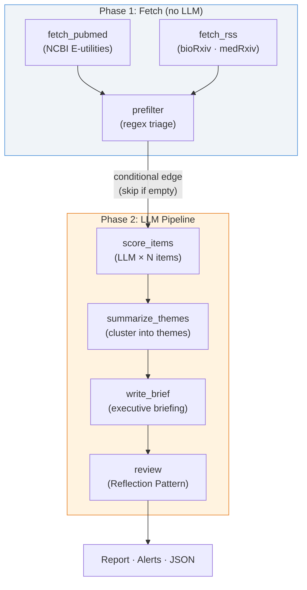

# NeuroTech Newshound

An **agentic AI research analyst** that monitors the NeuroTech ecosystem — implantable BCIs, ECoG/sEEG, microstimulation, enabling materials — and produces weekly intelligence briefings with LLM-scored relevance, thematic synthesis, and a reflection-based quality review.

Built with [LangGraph](https://github.com/langchain-ai/langgraph). Deployed on [OpenClaw](https://openclaw.ai/). Developed locally in [Cursor](https://cursor.com/).

---

## What This Project Does

Each week, the agent:

1. **Fetches** recent publications from PubMed and preprints from bioRxiv/medRxiv
2. **Pre-filters** with domain-specific regex patterns (fast, free, deterministic)
3. **Scores** each candidate with an LLM that understands neuroscience — assessing relevance, categorizing, and flagging vaporware
4. **Clusters** scored items into 2–5 themes with significance ratings
5. **Writes** an executive brief (TL;DR, themes, alerts, what-to-watch)
6. **Reviews** the brief via a Reflection Pattern — a reviewer LLM critiques the analysis and adjusts scores

The entire pipeline runs in ~2 minutes and costs ~$0.005 per run with `gpt-4o-mini`.

---

## Architecture



### Design Patterns

- **Two-Stage Scoring**: Regex pre-filter (free, ~70 → ~25 items) followed by LLM assessment with domain-aware judgment. This keeps costs near-zero while leveraging LLM reasoning where it matters.
- **Reflection Pattern**: The reviewer node critiques the executive brief, checks calibration of significance ratings, flags missed connections, and calls out vaporware — mimicking a PI reviewing a research associate's work.
- **Conditional Edge**: If nothing passes the regex pre-filter (quiet week), the LLM pipeline is skipped entirely. No API cost on empty weeks.
- **Multi-Model Routing**: Different LLMs for analysis vs. review (e.g., `gpt-4o-mini` for bulk scoring, `gpt-4o` for critical review). Configurable via CLI or environment variables.

---

## Sample Output

From a real run (2026-02-16, 7-day lookback):

| Metric | Value |
|--------|-------|
| Raw items fetched | 70 |
| After regex pre-filter | 27 |
| LLM-scored items | 27 |
| Priority alerts (9–10) | 1 |
| Themes identified | 4 |
| LLM calls | 30 |
| Total tokens | 21,895 |
| Cost | $0.005 |
| Duration | ~2 min |

**Alert detected**: *"At-home movement state classification using totally implantable cortical-basal ganglia neural interface"* — scored 9/10 (implantable_bci). First-in-human, at-home classification of movement states using a fully implantable neural interface for Parkinson's disease.

The LLM correctly scored 19 of 27 pre-filtered items as `out_of_scope` (PubMed's broad query pulls in oncology papers with "ECOG" performance status — the LLM distinguishes this from ECoG electrocorticography).

---

## Project Structure

```
neurotech_newshound/
├── workspace/                         # 1:1 mirror of OpenClaw workspace
│   ├── SOUL.md                        # Agent identity & mission
│   ├── skills/
│   │   └── neuro_hound/
│   │       ├── SKILL.md               # Skill contract
│   │       ├── run.py                 # CLI entry point
│   │       ├── state.py               # HoundState TypedDict
│   │       ├── graph.py               # LangGraph StateGraph definition
│   │       ├── requirements.txt       # Python dependencies
│   │       ├── nodes/                 # Graph nodes (one file per node)
│   │       │   ├── fetch.py           #   PubMed + RSS fetchers
│   │       │   ├── prefilter.py       #   Regex pre-filter
│   │       │   ├── score.py           #   LLM per-item scoring
│   │       │   ├── summarize.py       #   Theme clustering + executive brief
│   │       │   └── review.py          #   Reflection (reviewer critique)
│   │       └── tools/                 # Shared utilities
│   │           ├── http.py            #   HTTP + SSL helper
│   │           ├── pubmed.py          #   PubMed E-utilities client
│   │           ├── rss.py             #   RSS feed parser
│   │           ├── scoring.py         #   Regex scoring patterns
│   │           └── llm.py             #   LLM factory + usage tracker
│   └── archives/neurotech/            # Reports land here (on droplet)
├── dev/
│   ├── test_run.py                    # Local test runner
│   └── sample_output/                 # Local test output (gitignored)
├── scripts/
│   ├── deploy.sh                      # rsync workspace → droplet
│   └── fetch_reports.sh               # rsync reports ← droplet
├── .env.example
├── .gitignore
└── README.md
```

---

## Scoring

### Two-Stage Pipeline

**Stage 1 — Regex Pre-filter** (free, deterministic):
Broad pattern matching keeps items mentioning BCIs, ECoG, sEEG, intracortical recording, microstimulation, etc. Removes obvious non-matches before any API calls.

**Stage 2 — LLM Scoring** (per-item, domain-aware):
Each pre-filtered item gets an individual LLM call with a neuroscience-specific prompt. The LLM returns a score, category, assessment, and vaporware flag.

| Score | Meaning | Examples |
|-------|---------|----------|
| **9–10** | Priority alert | First-in-human implant, FDA IDE/PMA/De Novo, pivotal trial |
| **7–8** | High signal | ECoG/sEEG recording study, single-unit data, closed-loop BCI |
| **5–6** | Moderate | Materials/biocompatibility, animal BCI, neural decoding methods |
| **3–4** | Low | Tangentially related neuroscience |
| **1–2** | Out of scope | Scalp EEG wearables, oncology, marketing |

### Categories

`implantable_bci` · `ecog_seeg` · `stimulation` · `materials` · `regulatory` · `funding` · `animal_study` · `methods` · `out_of_scope`

---

## Quick Start

### Prerequisites

- Python 3.11+
- An [OpenAI](https://platform.openai.com/) API key (for `gpt-4o-mini`). Gemini and Claude also supported.

### Setup

```bash
git clone https://github.com/your-username/neurotech_newshound.git
cd neurotech_newshound

pip install -r workspace/skills/neuro_hound/requirements.txt
cp .env.example .env
# Edit .env with your API key(s)
```

### Run Locally

```bash
# Full pipeline (LLM scoring + synthesis + reflection)
python dev/test_run.py --days 7

# Phase 1 only (regex scoring, no LLM cost)
python dev/test_run.py --phase1-only --days 7

# With a specific model
python dev/test_run.py --days 7 --model gpt-4o
```

Output goes to `dev/sample_output/`:
- `YYYY-MM-DD.md` — Full report with executive brief
- `YYYY-MM-DD.alerts.json` — Priority items (score 9–10)
- `YYYY-MM-DD.full.json` — Machine-readable results + usage metrics

### Deploy to OpenClaw Droplet

```bash
# Push code to droplet
bash scripts/deploy.sh

# Run on droplet (via SSH or OpenClaw chat)
ssh root@your-droplet
cd ~/.openclaw/workspace
python3 skills/neuro_hound/run.py --days 7

# Fetch reports back locally
bash scripts/fetch_reports.sh
```

---

## Data Sources

| Source | Type | API Key Required |
|--------|------|:---:|
| [PubMed](https://pubmed.ncbi.nlm.nih.gov/) (NCBI E-utilities) | Peer-reviewed articles | No |
| [bioRxiv](https://www.biorxiv.org/) | Neuroscience preprints | No |
| [medRxiv](https://www.medrxiv.org/) | Clinical preprints | No |

All sources are free and require no API keys. Only the LLM scoring/synthesis step requires an API key.

---

## Technologies

| Layer | Technologies |
|-------|-------------|
| **Agentic AI** | LangGraph, LangChain |
| **LLMs** | GPT-4o-mini (default), GPT-4o, Gemini 2.0 Flash, Claude (multi-model routing) |
| **Data Sources** | PubMed E-utilities, bioRxiv/medRxiv RSS |
| **NLP** | Regex pre-filter, LLM-based domain scoring |
| **Deployment** | OpenClaw, rsync, Digital Ocean |
| **Development** | Cursor IDE, Python 3.11+, python-dotenv |

---

## Evolution

| Phase | What | Status |
|-------|------|--------|
| **1** | Pure Python: PubMed + RSS fetch, regex scoring, markdown report | Done |
| **2** | LangGraph pipeline: LLM scoring, thematic synthesis, executive brief, reflection | **Active** |
| 3 | MLflow integration: run metrics, cost tracking, artifact logging, experiment comparison | Planned |

This project shares design patterns with [trading_etf](https://github.com/kgrajski/trading_etf), an ETF trading system with an agentic AI analyst — same LangGraph architecture, Reflection Pattern, and multi-model routing approach applied to a different domain.

---

## License

MIT
