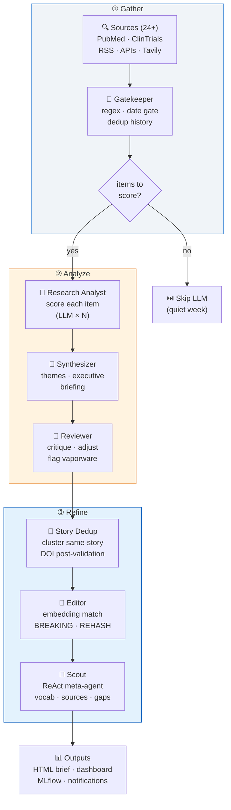
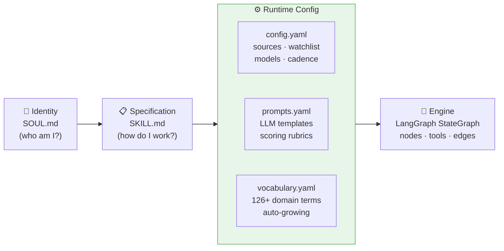
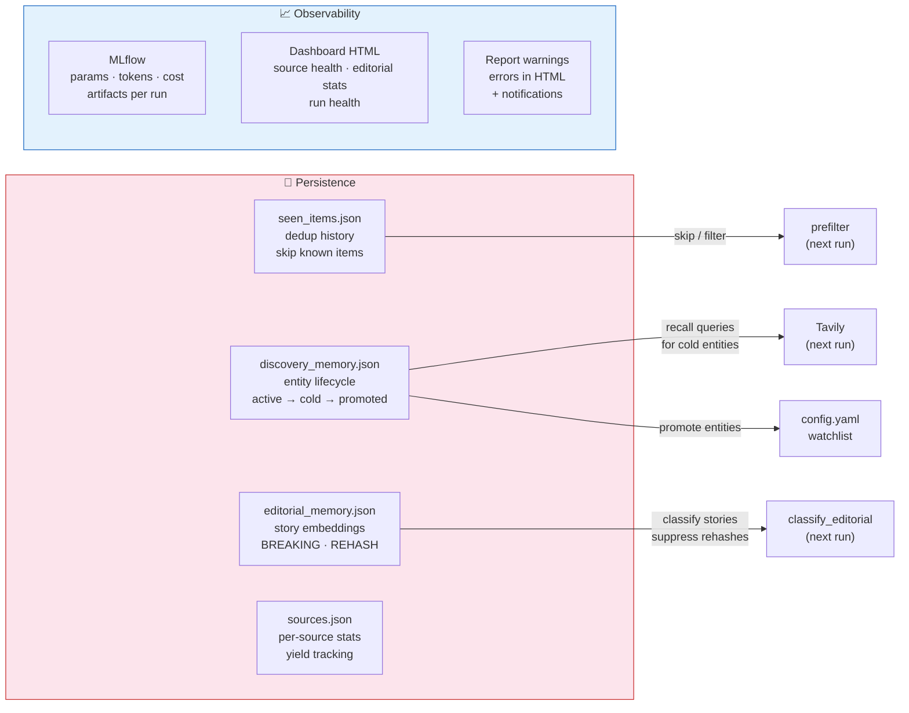
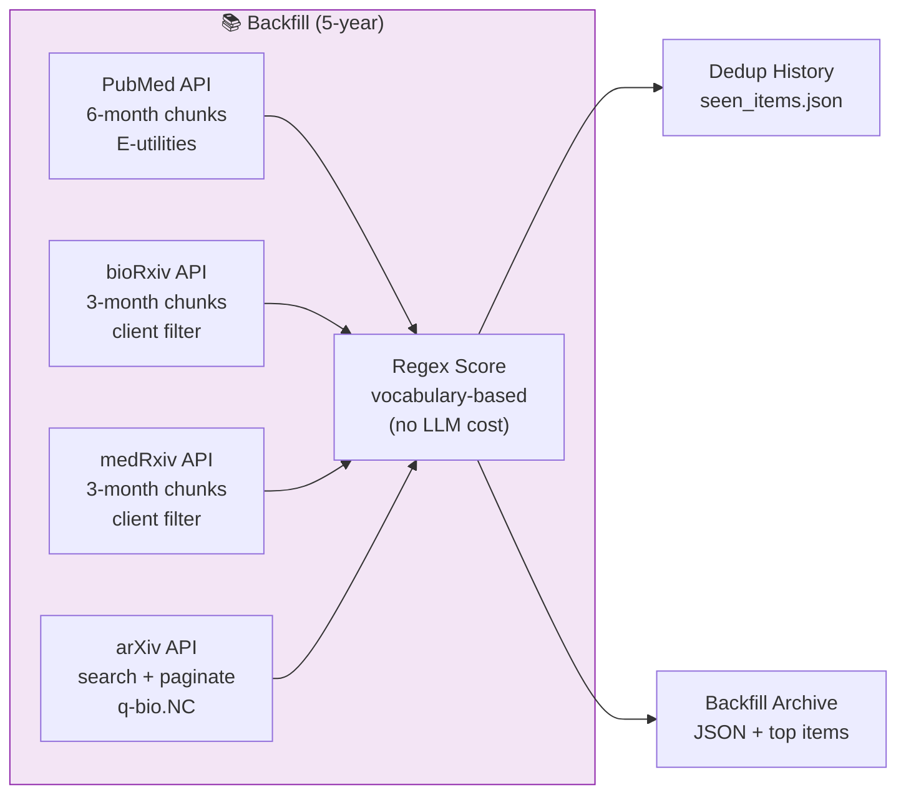

# NeuroTech NewsHound

An **agentic AI research analyst** that monitors the NeuroTech ecosystem — implantable BCIs, ECoG/sEEG, microstimulation, enabling materials — and produces nightly intelligence briefings (with weekly digests) featuring LLM-scored relevance, thematic synthesis, ensemble retrieval, persistent discovery memory, story-level deduplication, editorial memory with embedding-based semantic matching, and a reflection-based quality review.

Built with [LangGraph](https://github.com/langchain-ai/langgraph). Deployed on [OpenClaw](https://openclaw.ai/). Developed locally in [Cursor](https://cursor.com/).

---

## Agentic AI — A Quick Glossary

If you're new to agentic AI or just want a refresher, here's a cheat sheet for the key concepts used in this project. Each term links to where it lives in the codebase.

| Term | What It Is | Plain-English Analogy |
|------|-----------|----------------------|
| **Agent** | A program that uses an LLM to make decisions within a structured workflow — not just generate text, but _act_ (fetch data, score items, write reports). | A research analyst who follows a process but uses judgment at each step. |
| [**SOUL.md**](workspace/SOUL.md) | Defines the agent's _identity_ — its name, domain focus, values, and boundaries. Short and stable. Think "who am I?" | A job description's mission statement. |
| [**SKILL.md**](workspace/skills/neuro_hound/SKILL.md) | The complete _operational specification_ — goals, tools, workflow, scoring criteria, constraints. Think "how do I do my job?" | A detailed SOP (Standard Operating Procedure). |
| [**config.yaml**](workspace/skills/neuro_hound/config.yaml) | Runtime settings a user edits without touching code — sources, models, company watchlist, Tavily queries. | The knobs and dials on a control panel. |
| [**prompts.yaml**](workspace/skills/neuro_hound/prompts.yaml) | All LLM prompt templates in one file. Edit to change _how_ the LLM reasons, without changing _what_ the pipeline does. | The instructions you'd give a new hire. |
| [**vocabulary.yaml**](workspace/skills/neuro_hound/vocabulary.yaml) | Domain vocabulary (126+ terms) used to dynamically construct PubMed queries and regex filters. Grows as new papers are processed. | A specialist's glossary that expands with experience. |
| **Tool** | A Python module that does one thing — fetch from PubMed, search Tavily, score with regex, load config. Tools live in `tools/`. | Individual instruments in a lab. |
| **Node** | A step in the workflow graph — each node calls one or more tools, updates the shared state, and passes control to the next node. Nodes live in `nodes/`. | A station on an assembly line. |
| **State** | A typed Python dict (`HoundState`) that flows through the graph. Each node reads from it and writes to it. | A clipboard passed from station to station. |
| **[LangGraph](https://github.com/langchain-ai/langgraph)** | The framework that wires nodes into a directed graph with conditional edges (e.g., "skip LLM if nothing passed regex"). | The conveyor belt connecting the stations. |
| **Reflection Pattern** | A second LLM call that _critiques_ the first LLM's output — checking calibration, spotting missed connections, flagging vaporware. | A senior reviewer reading a junior analyst's draft. |
| **ReAct Pattern** | A multi-turn loop where the LLM _reasons_ (Thought), _acts_ (calls a tool), and _observes_ the result — then decides what to do next. The agent, not the code, chooses which tools to use. | A researcher who checks their work, notices a gap, looks something up, and decides whether to keep going. |
| **Meta-Tools** | Functions the ReAct meta-agent can call — check vocabulary gaps, assess source health, discover companies, evaluate coverage. Defined in `tools/meta_tools.py`. | The reference books and checklists the researcher reaches for. |
| **Discovery Memory** | Persistent JSON store (`discovery_memory.json`) that tracks entities across runs. Implements Retain/Recall/Reflect: entities are retained after scoring, recalled via targeted queries when they go cold, and reflected upon by the meta-agent. | A field notebook where the analyst writes down every company and development they encounter, and checks it before each new search. |
| **Editorial Memory** | Persistent store (`editorial_memory.json`) that tracks _stories reported to the user_ — not just items seen by the pipeline. Uses OpenAI embeddings (`text-embedding-3-small`) for deterministic semantic matching. Each reported story gets an embedding of its title + LLM assessment, enabling cosine similarity matching against future candidates. Stories are classified as BREAKING, DISCOVERY, FOLLOW-UP, or REHASH. | The editor's memory of what's already been published — "we covered this last Tuesday" vs. "this is genuinely new." |
| **[MLflow](https://mlflow.org/)** | Experiment tracker that logs every run — parameters, token costs, artifacts. Lets you compare runs over time. | A lab notebook that records every experiment. |

> **Why so many files?** Each layer has one job: SOUL.md says _who_, SKILL.md says _how_, config.yaml says _what to monitor_, prompts.yaml says _what to ask the LLM_, and vocabulary.yaml says _what terms to search for_. This separation means you can change the search vocabulary without editing code, or swap the LLM model without touching prompts. See [ADR-001](docs/ADR-001-agent-specification.md) for the full rationale.

---

## What This Project Does

Each night (with a 7-day lookback and weekly digest on Saturdays), the agent:

1. **Fetches** from 24+ sources — PubMed, ClinicalTrials.gov, journal RSS feeds (Nature, Nature Neuroscience, Science, Lancet Neurology, Neuron, NEJM, IEEE TNSRE, ...), preprint servers (bioRxiv, medRxiv, arXiv), company Substacks (auto-injected from watchlist), company news/press pages (site-scoped Tavily queries), general press (NYT, FT, STAT News), FDA MedWatch, and Tavily wideband search (with auto-generated queries from a company watchlist of 11 BCI companies)
2. **Pre-filters** with domain-specific regex patterns built from a 126-term domain vocabulary (fast, free, deterministic)
3. **Date-gates** to discard stale items (Tavily's date filter is unreliable — items from months ago can slip through)
4. **Deduplicates** against a history of previously-scored items — skips confirmed low-value repeats, re-evaluates high-value items
5. **Scores** each candidate with an LLM that understands neuroscience — assessing relevance, estimating content freshness (content type, publication date), categorizing, and flagging vaporware. Evergreen pages and stale content are automatically downscored.
6. **Story-deduplicates** by sending all scored items to an LLM that groups items about the same underlying story (e.g., "China approves brain implant" from Reuters, Euronews, and SCMP become one alert with "also reported by" references)
7. **Classifies editorially** — each story is matched against an embedding-based editorial memory of previously reported stories. Items are classified as BREAKING (genuinely new), DISCOVERY (old but never reported), FOLLOW-UP (previously reported, new sources), or REHASH (already reported, no new info — suppressed from alerts and score-capped at 6)
8. **Clusters** scored items into 2–5 themes with significance ratings
9. **Writes** an executive brief (TL;DR, themes, alerts, what-to-watch) — written *after* editorial classification, so the brief reflects only genuinely new stories
10. **Reviews** the brief via a Reflection Pattern — a reviewer LLM critiques the analysis and adjusts scores
11. **Meta-reflects** using a ReAct agent that reasons about the pipeline's output and decides which self-improvement actions to take — checking vocabulary gaps, source health, coverage blind spots, and discovering new companies. The LLM chooses which tools to call (or none, on a quiet week).
12. **Produces** a polished HTML report (with Breaking News, Discoveries, and Follow-ups sections), operational dashboard (with editorial memory stats and run health), markdown report, alerts JSON, meta-agent trace, and full results JSON
13. **Notifies** via WhatsApp/Telegram with alert count, theme count, and warning count (names failing sources)
14. **Logs** to MLflow — parameters, token/cost metrics, per-source yield, and report artifacts

All sources, models, and behavior are configured via YAML files (`config.yaml`, `prompts.yaml`, `vocabulary.yaml`) — no code edits needed to add sources, change models, update prompts, or expand search vocabulary.

The nightly pipeline runs in ~8 minutes and costs ~$0.38 per run with `gpt-4o` (~$11/month at daily cadence). A budget-conscious alternative uses `gpt-4o-mini` at ~$0.02/run but with reduced freshness judgment. The 7-day lookback on daily runs is intentional: dedup prevents re-scoring already-seen items, and the longer window catches items that take several days to percolate through indexing pipelines (PubMed, Tavily, RSS aggregators). A separate **backfill mode** fetches 5 years of historical data from PubMed, bioRxiv, medRxiv, and arXiv using their archival APIs.

---

## Architecture

The system has two operating modes: a **nightly pipeline** (7-day lookback with dedup, plus Saturday weekly digest) that monitors current activity across 24+ sources, and a **backfill mode** that builds historical depth from archival APIs (PubMed, bioRxiv, medRxiv, arXiv). Both modes feed the same dedup history, source registry, and discovery memory.

The architecture is presented in three views: what the pipeline *does*, how it's *controlled*, and what it *remembers*.

### A. What It Does — Nightly Pipeline

The end-to-end flow wraps top-to-bottom in three stages. Diamonds show where the system decides; roles label each step.


```mermaid
flowchart TD
    subgraph gather ["① Gather"]
        direction LR
        SRC["🔍 Sources (24+)<br>PubMed · ClinTrials<br>RSS · APIs · Tavily"] --> GK["🧹 Gatekeeper<br>regex · date gate<br>dedup history"] --> D1{items to<br>score?}
    end

    D1 -->|no| SKIP["⏭️ Skip LLM<br>(quiet week)"]
    D1 -->|yes| RA

    subgraph analyze ["② Analyze"]
        direction LR
        RA["🧠 Research Analyst<br>score each item<br>(LLM × N)"] --> SY["📝 Synthesizer<br>themes · executive<br>briefing"] --> RV["🔬 Reviewer<br>critique · adjust<br>flag vaporware"]
    end

    RV --> SD

    subgraph refine ["③ Refine"]
        direction LR
        SD["🔗 Story Dedup<br>cluster same-story<br>DOI post-validation"] --> ED["📰 Editor<br>embedding match<br>BREAKING · REHASH"] --> SC["🔭 Scout<br>ReAct meta-agent<br>vocab · sources · gaps"]
    end

    SC --> OUT["📊 Outputs<br>HTML brief · dashboard<br>MLflow · notifications"]

    style gather fill:#f0f4f8,stroke:#4a90d9
    style analyze fill:#fff3e0,stroke:#e67e22
    style refine fill:#e3f2fd,stroke:#1565c0
```

### B. How It's Controlled — Configuration Layers

No code edits needed to change sources, models, prompts, or vocabulary. Each layer has one job.


```mermaid
flowchart LR
    SOUL["🪪 Identity<br>SOUL.md<br>(who am I?)"] --> SKILL["📋 Specification<br>SKILL.md<br>(how do I work?)"]

    SKILL --> CFGBOX

    subgraph CFGBOX ["⚙️ Runtime Config"]
        direction LR
        C1["config.yaml<br>sources · watchlist<br>models · cadence"]
        C2["prompts.yaml<br>LLM templates<br>scoring rubrics"]
        C3["vocabulary.yaml<br>126+ domain terms<br>auto-growing"]
    end

    CFGBOX --> ENG["🔧 Engine<br>LangGraph StateGraph<br>nodes · tools · edges"]

    style CFGBOX fill:#e8f5e9,stroke:#43a047
```

### C. What It Remembers — Persistence & Observability

The system learns across runs. Memory feeds back into retrieval; MLflow tracks every experiment.


```mermaid
flowchart LR
    subgraph persist ["💾 Persistence"]
        H["seen_items.json<br>dedup history<br>skip known items"]
        DM["discovery_memory.json<br>entity lifecycle<br>active → cold → promoted"]
        EM["editorial_memory.json<br>story embeddings<br>BREAKING · REHASH"]
        SR["sources.json<br>per-source stats<br>yield tracking"]
    end

    subgraph observe ["📈 Observability"]
        ML["MLflow<br>params · tokens · cost<br>artifacts per run"]
        DA["Dashboard HTML<br>source health · editorial stats<br>run health"]
        ER["Report warnings<br>errors in HTML<br>+ notifications"]
    end

    DM -->|"recall queries<br>for cold entities"| TAVILY["Tavily<br>(next run)"]
    DM -->|"promote entities"| CFG["config.yaml<br>watchlist"]
    H -->|"skip / filter"| FILTER["prefilter<br>(next run)"]
    EM -->|"classify stories<br>suppress rehashes"| CLASS["classify_editorial<br>(next run)"]

    style persist fill:#fce4ec,stroke:#c62828
    style observe fill:#e3f2fd,stroke:#1565c0
```

### Backfill Mode

A separate entry point (`backfill.py`) fetches 5 years of historical data from archival APIs (PubMed, bioRxiv, medRxiv, arXiv), regex-scores them, and feeds the dedup history. No LLM cost.


```mermaid
flowchart LR
    subgraph backfill ["📚 Backfill (5-year)"]
        direction LR
        BP["PubMed API<br>6-month chunks<br>E-utilities"] --> RS
        BB["bioRxiv API<br>3-month chunks<br>client filter"] --> RS
        BM["medRxiv API<br>3-month chunks<br>client filter"] --> RS
        BA["arXiv API<br>search + paginate<br>q-bio.NC"] --> RS
    end

    RS["Regex Score<br>vocabulary-based<br>(no LLM cost)"]
    RS --> DH["Dedup History<br>seen_items.json"]
    RS --> AR["Backfill Archive<br>JSON + top items"]

    style backfill fill:#f3e5f5,stroke:#8e24aa
```

### Design Patterns

- **Config-Driven Sources**: All 24+ sources defined in `config.yaml`. Add a journal by adding 4 lines of YAML — no code changes needed.
- **Adaptive Source Management**: The company watchlist auto-generates Tavily queries from aliases and injects Substack RSS feeds. The ReAct meta-agent can discover new companies, flag cold sources, and propose new feeds.
- **ReAct Meta-Reflection**: After the pipeline completes, a genuine ReAct agent receives the output and decides which self-improvement tools to invoke — vocabulary gap detection, source health checks, company discovery, coverage assessment. The LLM reasons about *whether* to act (not a fixed code path). Trace logged to `meta_actions.yaml`.
- **Dynamic Query Construction**: PubMed queries are built at runtime from `vocabulary.yaml` (126+ domain terms extracted from representative papers). The vocabulary grows as new papers are processed and self-stabilizes as domain terminology is finite.
- **Ensemble Retrieval**: Each Tavily query is expanded into synonym-swapped variants (e.g., "brain-computer interface" → "brain-machine interface", "neural prosthesis"). All variants run independently and results are unioned. This counters retrieval stochasticity — the same query to Tavily returns different results across runs — by casting a wider net. Configurable via `ensemble.variants_per_query` in `config.yaml` (default: 2 variants per base query = 3× coverage). See [Generative Query Reformulation](https://arxiv.org/abs/2405.17658).
- **Discovery Memory (HindSight)**: Persistent `discovery_memory.json` tracks entities discovered via Tavily across runs. Implements three phases: **Retain** (after scoring, extract entities and update memory with `times_seen`, `best_score`, `consecutive_misses`), **Recall** (before Tavily fetch, generate targeted queries for cold/active entities not seen recently), and **Reflect** (meta-agent reviews memory health, detects cold entities, and promotes consistently-seen entities to the watchlist). Entities transition through states: `active` → `cold` → `archived` (or `promoted`). See [Hindsight](https://arxiv.org/abs/2512.12818).
- **Date Gating**: Post-fetch date validator parses publication dates from all source formats (RSS `pubDate`, Atom `updated`, PubMed `PubDate`, ISO dates, long-form dates) and discards items outside the lookback window. Compensates for Tavily's unreliable `days` parameter — which sometimes returns results from months ago — by enforcing a hard date cutoff with a 2-day grace period for indexing lag. Items with no parseable date pass through.
- **Company News Monitoring**: Site-scoped Tavily queries (`site:paradromics.com`, `site:precisionneuro.io`, etc.) target each watchlist company's own news/press page. This ensures company announcements are captured from primary sources, not just secondary coverage. Configured via `news_url` field on watchlist entries.
- **Story Clustering**: After LLM scoring, a single GPT-4o-mini call clusters items that report the same underlying story (e.g., 5 articles about "China approves brain implant" from different outlets). Each cluster keeps one primary item (highest score) with "also reported by" links; secondary items are demoted from alerts. Eliminates the alert spam problem where 5 sources covering the same event produce 5 separate high-priority alerts.
- **Three-Stage Scoring**: Regex pre-filter → date gate → dedup (free, ~485 → ~56 → ~40 items) followed by LLM assessment with domain-aware judgment. Keeps costs near-zero while leveraging LLM reasoning where it matters.
- **Deduplication**: Hash-based history tracks every scored item. Items scored < 7 in prior runs are skipped (confirmed low-value). Items ≥ 7 are re-evaluated (things evolve — a preprint becomes a publication, a trial advances).
- **Reflection Pattern**: The reviewer node critiques the executive brief, checks calibration of significance ratings, flags missed connections, and calls out vaporware — mimicking a PI reviewing a research associate's work. (Company discovery has moved to the ReAct meta-agent.)
- **Source Registry**: JSON-persisted registry tracks per-source yield stats (items fetched, in-scope count, last hit date). Supports auto-discovery of new sources via Tavily and cold-source pruning.
- **Historical Backfill**: Separate entry point (`backfill.py`) fetches 5 years of archival data from PubMed, bioRxiv, medRxiv, and arXiv using their APIs (RSS feeds are current-only). Regex-scored and stored in the dedup history for future runs.
- **Conditional Edge**: If nothing passes the regex pre-filter (quiet week), the LLM pipeline is skipped entirely. No API cost on empty weeks.
- **Multi-Model Routing**: Different LLMs for analysis vs. review (e.g., `gpt-4o` for scoring with freshness judgment, `gpt-4o-mini` as a budget alternative). Configurable via `config.yaml` or CLI.

---

## Sample Output

**Browse the actual output from a real run:**

- [**HTML Intelligence Briefing**](https://kgrajski.github.io/neurotech_newshound/docs/samples/report.html) — the full report with Breaking News, Discoveries, Follow-ups, themes, and scored items with editorial classification badges
- [**Operational Dashboard**](https://kgrajski.github.io/neurotech_newshound/docs/samples/dashboard.html) — source health, editorial memory stats, config, run metrics, dedup history

From a real run (2026-04-08, 7-day lookback, 24 sources, gpt-4o with freshness estimation):

| Metric | Value |
|--------|-------|
| Raw items fetched | 704 |
| Sources active | 24 (incl. medRxiv/bioRxiv API, company news pages, LinkedIn) |
| After regex + date gate | 101 |
| LLM-scored items | 101 |
| Content types detected | 45 research papers, 27 news articles, 7 evergreen pages, 7 company pages, 6 press releases, 4 conferences, 4 review articles, 1 clinical trial |
| Unique stories (after clustering) | 97 |
| Story clusters | 3 (Paradromics first-in-human, Precision FDA clearance, Synchron first US implant) |
| Editorial classification | 34 breaking, 1 discovery, 0 follow-ups, 0 rehashes |
| Priority alerts (9–10, unique) | 17 |
| Themes identified | 4 (1 breakthrough) |
| Meta-agent tool calls | 5 (vocabulary, source health, coverage, cold source flag, assessment) |
| Total tokens | 108,916 |
| Cost | $0.38 |
| Duration | ~8 min |

**Breaking News** — 17 unique stories after story-level dedup and editorial classification:
- *"Brain-Controlled Epidural Stimulation Reveals Enhanced Corticospinal Excitability"* — score 9, first-in-human BCI + epidural stimulation for tetraplegia (implantable_bci)
- *"Paradromics Completes First-In-Human Recording"* — score 9, **3 sources** (implantable_bci)
- *"FDA clears Precision Neuroscience's minimally invasive brain implant"* — score 9, also reported via LinkedIn (regulatory)
- *"Neuralink's Blindsight Receives FDA Breakthrough Device Designation"* — score 9 (regulatory)
- *"China just approved its first brain implant for commercial use"* — score 9 (regulatory)
- *"Synchron Announces First Human U.S. Brain-Computer Interface Implant"* — score 9 (implantable_bci)
- ...plus 11 more breaking alerts

**Freshness estimation in action:** The upgraded gpt-4o scoring model now classifies each item's content type (research paper, news article, company page, evergreen page, etc.) and estimates publication date. Company "About" pages and evergreen content are capped at score 5, preventing permanent web pages from appearing as breaking alerts. In this run, 14 evergreen/company pages were correctly identified and downscored.

**Pipeline reordering:** Editorial classification now runs *before* the executive brief is written (previously it ran after). This means the TL;DR and priority alerts in the brief reflect only genuinely new stories — not rehashes that would later be suppressed.

**Story clustering in action:** 3 multi-source story clusters identified — the Paradromics first-in-human was covered by 3 outlets, all collapsed into one primary alert with "also reported by" links.

**LinkedIn coverage:** The Tavily LinkedIn queries surfaced an additional source for the Precision Neuroscience FDA clearance story, confirming cross-channel coverage.

---

## Agent Specification Layers

This project uses a four-layer specification architecture. Each layer has a
single responsibility and a clear authority:

| Layer | File | What it controls | Consumed by |
|-------|------|------------------|-------------|
| **Identity** | [`SOUL.md`](workspace/SOUL.md) | Personality, values, meta-goals | OpenClaw host agent |
| **Specification** | [`SKILL.md`](workspace/skills/neuro_hound/SKILL.md) | Goals, tools, workflow, constraints | Developers + OpenClaw |
| **Configuration** | [`config.yaml`](workspace/skills/neuro_hound/config.yaml) | Sources, watchlist, models | Python pipeline |
| **Prompts** | [`prompts.yaml`](workspace/skills/neuro_hound/prompts.yaml) | LLM prompt templates | Python pipeline |
| **Vocabulary** | [`vocabulary.yaml`](workspace/skills/neuro_hound/vocabulary.yaml) | Domain terms for PubMed/regex queries | Python pipeline |

**Why both SOUL.md and SKILL.md?** The project is deployed on [OpenClaw](https://openclaw.ai/),
which uses a SOUL.md + SKILL.md convention (identity shared across skills,
SKILL.md per capability). The [Anthropic/DeepLearning.ai pattern](https://www.deeplearning.ai/)
centers everything on SKILL.md alone. Neither is an industry standard. We
retain both for OpenClaw compatibility, but keep SOUL.md slim (identity only)
and SKILL.md comprehensive (the complete operational spec). See
[ADR-001](docs/ADR-001-agent-specification.md) for the full rationale.

**An honest note on agency:** The core pipeline (fetch/score/synthesize/review)
is a fixed LLM-augmented workflow — deterministic, efficient, and predictable.
Phase 9 added a genuine agentic layer: a ReAct meta-agent that _reasons_ about
the pipeline's output and _decides_ which self-improvement tools to call
(vocabulary updates, source health, company discovery, coverage assessment).
The agent chooses its actions at runtime — this is not a fixed code path. The
remaining gap: the agent does not yet read SOUL.md and SKILL.md itself to
derive its goals. See [ADR-001](docs/ADR-001-agent-specification.md) for the
full honesty analysis.

---

## Project Structure

```
neurotech_newshound/
├── workspace/                         # 1:1 mirror of OpenClaw workspace
│   ├── SOUL.md                        # Agent identity, values, meta-goals
│   ├── skills/
│   │   └── neuro_hound/
│   │       ├── SKILL.md               # Full operational specification
│   │       ├── config.yaml            # Sources, watchlist, models, behavior
│   │       ├── prompts.yaml           # LLM prompt templates (editable, MLflow-tracked)
│   │       ├── vocabulary.yaml        # Domain vocabulary for dynamic query construction
│   │       ├── run.py                 # CLI entry point (weekly pipeline)
│   │       ├── backfill.py            # Historical backfill (5-year, archival APIs)
│   │       ├── bootstrap_memory.py    # Seed discovery memory from existing data
│   │       ├── state.py               # HoundState TypedDict
│   │       ├── graph.py               # LangGraph StateGraph definition
│   │       ├── requirements.txt       # Python dependencies
│   │       ├── nodes/                 # Graph nodes (one file per node)
│   │       │   ├── fetch.py           #   PubMed + RSS + Tavily + preprint API fetchers
│   │       │   ├── prefilter.py       #   Regex pre-filter + date gate + dedup
│   │       │   ├── score.py           #   LLM per-item scoring
│   │       │   ├── summarize.py       #   Theme clustering + executive brief
│   │       │   ├── review.py          #   Reflection + score adjustment
│   │       │   ├── cluster.py         #   LLM story-level dedup (Phase 12)
│   │       │   ├── retain_memory.py   #   Discovery memory update (Phase 10b)
│   │       │   └── meta_reflect.py    #   ReAct meta-agent (Phase 9)
│   │       └── tools/                 # Shared utilities
│   │           ├── config.py          #   Config + prompts + watchlist loader
│   │           ├── vocabulary.py      #   Domain vocabulary manager + PubMed query builder
│   │           ├── http.py            #   HTTP + SSL helper
│   │           ├── pubmed.py          #   PubMed E-utilities client (weekly + backfill)
│   │           ├── clinicaltrials.py  #   ClinicalTrials.gov API v2 client
│   │           ├── biorxiv.py         #   bioRxiv/medRxiv API client (nightly + backfill)
│   │           ├── arxiv.py           #   arXiv API client (backfill)
│   │           ├── rss.py             #   Registry-driven RSS/Atom parser (weekly)
│   │           ├── tavily.py          #   Wideband search + company discovery
│   │           ├── sources.py         #   Source registry (JSON persistence)
│   │           ├── scoring.py         #   Regex scoring patterns
│   │           ├── dedup.py           #   Deduplication history
│   │           ├── date_utils.py      #   Date parsing + freshness gate
│   │           ├── memory.py          #   Discovery memory (HindSight pattern)
│   │           ├── llm.py             #   LLM factory + usage tracker
│   │           ├── meta_tools.py       #   ReAct meta-agent tool registry
│   │           ├── html_report.py     #   HTML report generator
│   │           ├── html_dashboard.py  #   Operational dashboard generator
│   │           └── mlflow_tracker.py  #   MLflow experiment logging
│   └── archives/neurotech/            # Reports + discoveries land here
├── docs/
│   ├── ADR-001-agent-specification.md # Architecture decision: spec layering
│   └── samples/                       # Sample output for README viewers
│       ├── report.html                #   HTML intelligence briefing
│       └── dashboard.html             #   Operational dashboard
├── dev/
│   ├── test_run.py                    # Local test runner
│   └── sample_output/                 # Local test output (gitignored)
├── scripts/
│   ├── deploy.sh                      # rsync workspace → droplet + install deps
│   ├── fetch_reports.sh               # rsync reports ← droplet
│   ├── run_remote.sh                  # Deploy + run + fetch in one command
│   ├── install_cron.sh                # Set up weekly Saturday cron on droplet
│   └── cron_run.sh                    # Cron wrapper (runs agent + notifications)
├── .env.example
├── .gitignore
└── README.md
```

---

## Configuration

Three YAML files control all runtime behavior — no code edits needed:

**`config.yaml`** — sources, models, company watchlist, Tavily queries:

```yaml
# Sources — add a new journal in 4 lines:
sources:
  - id: my_journal
    name: My New Journal
    category: journal
    type: rss
    url: "https://example.com/feed.xml"
    enabled: true

# Company watchlist — auto-generates Tavily queries + RSS feeds + news page monitoring:
company_watchlist:
  - name: Paradromics
    aliases: ["paradromics"]
    domain: "paradromics.com"
    news_url: "https://www.paradromics.com/news"   # site-scoped Tavily query
    substack: "https://paradromics.substack.com/feed"
    enabled: true

# Curated industry sources (no RSS — searched via Tavily):
curated_industry_sources:
  - name: Neurofounders
    tavily_query: 'site:neurofounders.co BCI OR neurotech'
    enabled: true
```

**`prompts.yaml`** — all LLM prompts as editable templates:

```yaml
score_item: |
  You are a senior neurotechnology research analyst...
  TITLE: {title}
  SCORING CRITERIA: ...
```

Edit prompts to iterate on analysis quality. Prompt text is logged to MLflow for tracking.

**`vocabulary.yaml`** — domain vocabulary for dynamic query construction:

```yaml
primary_terms:
  interfaces:
    - "brain-computer interface"
    - "BCI"
    - "neural implant"
  recording_modalities:
    - "electrocorticography"
    - "ECoG"
    - "micro-ECoG"
    # ... 126+ terms across 12 categories
```

PubMed queries are built at runtime from this vocabulary — no hardcoded queries. Terms are extracted from representative papers and tracked with provenance metadata. A configurable `max_terms_per_category` setting (default: no limit) provides a ceiling, though term counts naturally self-stabilize as domain vocabulary is finite.

---

## Data Sources

### Curated (23+ sources)

| Category | Sources |
|----------|---------|
| **Database** | [PubMed](https://pubmed.ncbi.nlm.nih.gov/) (NCBI E-utilities), [ClinicalTrials.gov](https://clinicaltrials.gov/) (REST API v2) |
| **Journals** | Nature, Nature Neuroscience, Nature BME, Science, Science TM, Science Robotics, J Neural Engineering, Neuron, Lancet Neurology, IEEE TNSRE, NEJM |
| **Preprints** | [bioRxiv](https://www.biorxiv.org/) (RSS + content API), [medRxiv](https://www.medrxiv.org/) (content API + Tavily safety net), [arXiv](https://arxiv.org/) q-bio.NC |
| **Press** | NYT Science, NYT Health, FT Technology, [STAT News](https://www.statnews.com/) |
| **Substacks** | [Neurotechnology](https://neurotechnology.substack.com/), [Paradromics](https://paradromics.substack.com/) + watchlist auto-feeds |
| **Regulatory** | [FDA MedWatch](https://www.fda.gov/safety/medwatch-fda-safety-information-and-adverse-event-reporting-program) |
| **Search** | [Tavily](https://tavily.com/) — static queries + auto-generated from company watchlist + curated industry sources + preprint safety net (`site:medrxiv.org`, `site:biorxiv.org`), with ensemble retrieval (synonym-swapped query variants, 3× coverage) |

### Company Watchlist

14 BCI companies tracked in `config.yaml`. Each entry auto-generates Tavily search queries from its aliases, Substack RSS feeds are auto-added when a URL is provided, and site-scoped Tavily queries target each company's news/press page when a `news_url` is configured. New companies can be added manually or promoted from `discoveries.yaml` (see below).

### Curated Industry Sources

Websites without RSS feeds (e.g., [Neurofounders](https://www.neurofounders.co/), IEEE Spectrum, [Friedman Brain Institute](https://icahn.mssm.edu/research/friedman-brain-institute), [BCI Society](https://bcisociety.org/), medRxiv, bioRxiv) are searched via Tavily `site:` queries as a safety net alongside direct API access.

### Auto-Discovery (via ReAct Meta-Agent)

After the main pipeline completes, the ReAct meta-agent reasons about the results and may:
1. **Discover companies**: Extract new BCI company names from high-scoring items and write them to `discoveries.yaml` for human review and promotion to the watchlist.
2. **Assess coverage**: Identify blind spots in topic coverage and suggest new search terms.
3. **Check source health**: Flag cold or underperforming sources.
4. **Expand vocabulary**: Detect domain terms from high-scoring items not yet in `vocabulary.yaml` and add them.
5. **Propose sources**: Suggest new RSS feeds or Tavily queries based on patterns in the results.

These are not fixed code paths — the LLM decides which tools to call (or none) based on the pipeline's output. The trace is logged to `meta_actions.yaml` and displayed on the operational dashboard.

The source registry caps at 40 sources and prunes cold (30-day no-hit) discovered sources automatically.

All data sources except Tavily and LLMs are free and require no API keys.

---

## Scoring

### Four-Stage Pipeline

**Stage 1 — Regex Pre-filter** (free, deterministic):
Broad pattern matching keeps items mentioning BCIs, ECoG, sEEG, intracortical recording, microstimulation, etc. Removes obvious non-matches before any API calls.

**Stage 2 — Date Gate** (free, deterministic):
Parses publication dates from all source formats and discards items outside the lookback window (+2 day grace period). Catches stale items from Tavily's unreliable date filtering.

**Stage 3 — Deduplication** (free, history-based):
Items previously scored < 7 are skipped. Items ≥ 7 are re-evaluated. First-time items always scored.

**Stage 4 — LLM Scoring** (per-item, domain-aware):
Each remaining item gets an individual LLM call with a neuroscience-specific prompt. The LLM returns a score, category, content type (research paper, news article, press release, evergreen page, etc.), estimated publication date, assessment, and vaporware flag. Evergreen pages and company "About" pages are capped at score 5; items older than 6 months lose 2–3 points.

| Score | Meaning | Examples |
|-------|---------|----------|
| **9–10** | Priority alert | First-in-human implant, FDA IDE/PMA/De Novo, pivotal trial |
| **7–8** | High signal | ECoG/sEEG recording study, single-unit data, closed-loop BCI |
| **5–6** | Moderate | Materials/biocompatibility, animal BCI, neural decoding methods |
| **3–4** | Low | Tangentially related neuroscience |
| **1–2** | Out of scope | Scalp EEG wearables, oncology, marketing |

### Categories

`implantable_bci` · `ecog_seeg` · `stimulation` · `materials` · `regulatory` · `funding` · `animal_study` · `methods` · `out_of_scope`

---

## Quick Start

### Prerequisites

- Python 3.11+
- An [OpenAI](https://platform.openai.com/) API key (for `gpt-4o`; `gpt-4o-mini` also supported). Gemini and Claude also supported.
- Optional: [Tavily](https://tavily.com/) API key (for wideband search)

### Setup

```bash
git clone https://github.com/kgrajski/neurotech_newshound.git
cd neurotech_newshound

pip install -r workspace/skills/neuro_hound/requirements.txt
cp .env.example .env
# Edit .env with your API key(s)
```

### Run Locally

```bash
# Daily run (7-day lookback, from config.yaml defaults)
python dev/test_run.py

# Full 7-day run
python dev/test_run.py --days 7

# Force weekly digest (aggregates past 7 days of daily reports)
python dev/test_run.py --weekly-digest

# Phase 1 only (regex scoring, no LLM cost)
python dev/test_run.py --phase1-only --days 7

# With a specific model
python dev/test_run.py --days 2 --model gpt-4o
```

Output goes to `dev/sample_output/`:
- `YYYY-MM-DD.html` — Polished HTML intelligence briefing
- `dashboard.html` — Operational dashboard (sources, config, run metrics, meta-agent trace)
- `YYYY-MM-DD.md` — Markdown report with executive brief
- `YYYY-MM-DD.alerts.json` — Priority items (score 9–10)
- `YYYY-MM-DD.full.json` — Machine-readable results + usage metrics
- `meta_actions.yaml` — ReAct meta-agent trace (tools called, reasoning, observations)

### Historical Backfill

```bash
# Full 5-year backfill (PubMed + bioRxiv + medRxiv + arXiv, ~60-90 min)
cd workspace/skills/neuro_hound
python3 -u backfill.py --start-year 2021 --end-year 2026 2>&1 | tee backfill_log.txt

# Fast pass (PubMed + arXiv only, ~5 min)
python3 -u backfill.py --start-year 2021 --end-year 2026 --sources pubmed,arxiv

# Dry run (fetch + score, don't update dedup history)
python3 -u backfill.py --start-year 2021 --end-year 2026 --dry-run
```

Output goes to `workspace/archives/neurotech/backfill/`:
- `backfill_YYYY-MM-DD.json` — Full archive with all scored items
- `backfill_YYYY-MM-DD_top.md` — Top 100 items by regex score

### View MLflow Results

```bash
mlflow ui --port 5000
# Open http://127.0.0.1:5000
```

### Deploy to OpenClaw Droplet

```bash
# Push code + API keys + install deps
bash scripts/deploy.sh

# Run on droplet via SSH
ssh root@your-droplet
cd /root/.openclaw/workspace/skills/neuro_hound
python3 -u run.py              # Daily (7-day lookback)
python3 -u run.py --days 7     # Weekly (7-day lookback)

# Bootstrap discovery memory from existing data (run once after first deploy)
python3 -u bootstrap_memory.py

# Fetch reports back locally
bash scripts/fetch_reports.sh
```

### Nightly Cron Job

```bash
# Install nightly midnight ET cron on the droplet
bash scripts/install_cron.sh
```

The cron job runs the agent every night at 05:00 UTC (midnight ET) with a 7-day lookback (dedup prevents re-scoring). On Saturdays, it also produces a weekly digest aggregating the past 7 days of daily reports. Notifications are sent via WhatsApp/Telegram (set `NOTIFY_PHONE` in `.env`) and include alert count, theme count, and any source warnings — so you'll know immediately if a source broke overnight.

Reports accumulate on the droplet. Pull them to your laptop whenever convenient — `rsync` only transfers new/changed files, so days of accumulated reports sync in seconds:

```bash
bash scripts/fetch_reports.sh   # Smart sync: pulls all new reports + state files
```

---

## Technologies

| Layer | Technologies |
|-------|-------------|
| **Agentic AI** | LangGraph, LangChain, ReAct pattern (custom implementation) |
| **LLMs** | GPT-4o (default), GPT-4o-mini, Gemini 2.0 Flash, Claude (multi-model routing) |
| **Data Sources** | PubMed E-utilities, ClinicalTrials.gov API v2, RSS/Atom (21+ feeds incl. Substacks), Tavily Search, bioRxiv/medRxiv API, arXiv API |
| **NLP** | Regex pre-filter, LLM-based domain scoring, deduplication |
| **Observability** | MLflow (params, metrics, artifacts per run) |
| **Output** | HTML report, operational dashboard, Markdown, JSON, MLflow artifacts |
| **Configuration** | YAML-driven (config.yaml + prompts.yaml + vocabulary.yaml — sources, models, prompts, vocabulary, watchlist) |
| **Agent Specification** | SOUL.md (identity) + SKILL.md (operational spec) — see [ADR-001](docs/ADR-001-agent-specification.md) |
| **Scheduling** | Nightly cron (05:00 UTC), 7-day lookback, Saturday weekly digest |
| **Deployment** | OpenClaw, rsync, Digital Ocean |
| **Development** | Cursor IDE, Python 3.11+, python-dotenv |

---

## Evolution

| Phase | What | Status |
|-------|------|--------|
| **1** | Pure Python: PubMed + RSS fetch, regex scoring, markdown report | Done |
| **2** | LangGraph pipeline: LLM scoring, thematic synthesis, executive brief, reflection | Done |
| **3** | Source expansion: 21 sources (journals, press, FDA, Tavily wideband search) | Done |
| **4** | HTML report, MLflow observability, deduplication | Done |
| **5** | Config-driven architecture, operational dashboard, branding | Done |
| **6** | OpenClaw deployment, weekly cron, WhatsApp/Telegram notifications | Done |
| **7** | Company watchlist, Substack RSS, externalized prompts, auto-discovery, agent spec refactor ([ADR-001](docs/ADR-001-agent-specification.md)) | **Done** |
| **7b** | Domain vocabulary store (`vocabulary.yaml`), dynamic PubMed query construction, keyword bootstrapping from papers | **Done** |
| **8** | Historical backfill mode (PubMed, bioRxiv/medRxiv, arXiv APIs — 5-year depth) | **Done** |
| **9** | Agentic meta-layer: ReAct meta-agent with tool-calling for vocabulary, source health, company discovery, coverage assessment | **Done** |
| **10** | Ensemble retrieval: synonym-swapped query variants (3× Tavily coverage), config-driven `ensemble.variants_per_query` | **Done** |
| **10b** | Discovery memory (HindSight pattern): persistent `discovery_memory.json` with retain/recall/reflect across sessions, meta-agent memory tools, bootstrap from existing data | **Done** |
| **10c** | Daily cadence: nightly runs (05:00 UTC) with 7-day lookback + dedup, auto weekly digest on Saturdays, `--weekly-digest` CLI flag | **Done** |
| **11** | Report quality: date gate (discard stale items), company news page monitoring (site-scoped Tavily), operational observability (run health on dashboard, errors in HTML report, warning counts in notifications) | **Done** |
| **12** | Story-level dedup: LLM clustering groups same-story items from different sources, keeps primary with "also reported by" links, demotes secondaries from alerts | **Done** |
| **13** | Academic coverage: medRxiv/bioRxiv content API search (nightly pipeline node), site-scoped Tavily safety net for preprints | **Done** |
| **14** | Editorial memory: embedding-based story matching (`editorial_memory.json`), story classification (BREAKING/DISCOVERY/FOLLOW-UP/REHASH), report restructured into Breaking News/Discoveries/Follow-ups, REHASH suppression, editorial memory dashboard stats | **Done** |
| **15** | Signal quality: freshness-aware scoring (content type + estimated date), pipeline reorder (editorial classification before brief), REHASH score demotion, URL normalization dedup, gpt-4o upgrade, LinkedIn source coverage | **Done** |
| 16 | Auto-publish to [nurosci.com](https://nurosci.com) | Planned |

This project shares design patterns with [trading_etf](https://github.com/kgrajski/trading_etf), an ETF trading system with an agentic AI analyst — same LangGraph architecture, Reflection Pattern, and multi-model routing approach applied to a different domain.

---

## Current Development Focus

**Retrieval stochasticity — the problem, and our three-layer solution.**

During a routine weekly run, our reviewer flagged a false negative: a non-invasive BCI company (Synaptrix Labs) had been incorrectly classified as out-of-scope. We fixed the scoring — broadened vocabulary, added a false-negative sweep to the reflection step, softened the regex pre-filter. Good engineering, problem solved. Then we re-ran the pipeline. Synaptrix didn't appear at all. Not misclassified — *absent*. The Tavily web search API, our wideband discovery source, is non-deterministic: the same query returns different results across runs. The world hadn't changed in the past hour, but our report had.

This is not a bug — it's a fundamental property of agentic systems that rely on external tool-calling for retrieval. The literature calls it **retrieval stochasticity** ([Stochasticity in Agentic Evaluations](https://arxiv.org/abs/2512.06710), [ReproRAG](https://arxiv.org/abs/2509.18869)), and the research shows that agentic retrieval tasks require 8–16 repeated trials to converge to stable results. We are addressing this with three layers:

**Layer 1 — Ensemble Retrieval (Phase 10, done).** Each Tavily query is expanded into synonym-swapped variants using a domain-specific synonym map (e.g., "brain-computer interface" → "brain-machine interface" / "neural interface"; "clinical trial" → "first-in-human" / "FDA trial"). All variants run independently and results are unioned. With `ensemble.variants_per_query: 2`, each base query generates up to 3 API calls (original + 2 rewrites), tripling the retrieval surface without any LLM cost. Validated by [Generative Query Reformulation](https://arxiv.org/abs/2405.17658) showing up to 18% recall improvement with ensemble strategies.

**Layer 2 — Discovery Memory (Phase 10b, done).** Persistent `discovery_memory.json` implementing the Retain/Recall/Reflect pattern from [Hindsight](https://arxiv.org/abs/2512.12818). Every entity discovered via Tavily is retained with `first_seen`, `last_seen`, `times_seen`, `best_score`, and `status`. On each run, "active" entities not seen recently are recalled via targeted re-search queries injected into the Tavily pipeline. The meta-agent reflects on memory health and auto-promotes consistently seen entities to `company_watchlist` in `config.yaml`.

**Layer 3 — Daily Cadence (Phase 10c, done).** Switched from weekly to nightly runs (7-day lookback with dedup) to increase temporal sampling. Higher sampling frequency means the ensemble + memory layers have more data points to work with, and the agent tracks the news cycle in near real-time. Lightweight daily reports with a Saturday weekly digest rollup.

**Layer 4 — Report Quality (Phase 11, done).** Three fixes for report quality issues identified during first live testing: (a) a **date gate** in the prefilter discards items with publication dates outside the lookback window — Tavily's `days` parameter is unreliable and was surfacing news from months ago; (b) **company news monitoring** via site-scoped Tavily queries targeting each watchlist company's own press page (the original and best source for company announcements); (c) **operational observability** — errors and warnings now surface in the HTML report, the operational dashboard (Run Health section), and the WhatsApp/Telegram notification (names failing sources instead of silently succeeding).

**Layer 5 — Story Clustering (Phase 12, done).** After LLM scoring, a single GPT-4o-mini call clusters items that report the same underlying story — e.g., "China approves first commercial brain implant" reported by Reuters, Euronews, SCMP, and two other outlets. Each cluster keeps one primary item (highest score) with "also reported by" links to the others; secondary items are demoted from alerts and hidden from the main scored-items list. This eliminates the alert spam problem where the same event covered by 5 sources produced 5 separate high-priority alerts.

**Layer 6 — Academic Coverage (Phase 13, done).** Two-pronged approach to fix the gap in preprint coverage: (a) a new `fetch_preprints_api` node queries the medRxiv and bioRxiv content APIs directly (paginating through all recent preprints and filtering client-side for BCI relevance using the domain vocabulary regex — the API has no search parameter); (b) site-scoped Tavily safety net queries (`site:medrxiv.org`, `site:biorxiv.org`) catch papers that might be missed by either the RSS feeds (which were returning 0 items) or the API (which only supports date-range browsing). The RSS feeds remain as a third channel — when they work.

**Layer 7 — Editorial Memory (Phase 14, done).** After running the nightly pipeline for several days, a pattern became clear: the agent's biggest remaining blind spot wasn't in what it *found* — it was in what it *said*. The same Precision Neuroscience FDA approval appeared as 3 separate high-priority alerts on successive days, each from a different news source. A 2021 academic paper kept surfacing as a score-9 alert because Tavily returned it without a reliable publication date. "Meet the Stentrode" — established Synchron technology — was ranked alongside genuinely new developments. Meanwhile, a fascinating Imperial College BCI project appeared only once, tagged no differently from breaking news, even though it was an older paper surfaced for the first time.

The fundamental gap was the difference between *deduplication* (has the pipeline seen this URL before?) and *editorial memory* (has the user been told about this story?). Discovery memory (Layer 2) tracks entities — companies, labs, organizations. Story clustering (Layer 5) groups items about the same event within a single run. But neither answers the editorial question: "Did we already report this to the reader?"

Editorial memory (`editorial_memory.json`) extends the HindSight pattern from entities to stories. After each run, every reported story gets an embedding computed from its title + LLM assessment using `text-embedding-3-small`. On the next run, each new candidate is embedded and compared against stored stories via cosine similarity. This matching is deterministic — unlike chat completions, embedding models produce the same vector for the same input every time (no sampling, no temperature). A threshold of 0.82 reliably distinguishes "same story from different source" from "different story with similar keywords."

Each story is classified: **BREAKING** (genuinely new, not in editorial memory), **DISCOVERY** (publication date >90 days old, but never reported — these are the valuable finds that justify the agent's existence), **FOLLOW-UP** (previously reported story with new sources), or **REHASH** (already reported, no new information — suppressed from alerts). The HTML report is restructured into Breaking News, Discoveries, and Follow-ups sections, and the scored items table shows classification badges. The dashboard displays editorial memory stats and per-run classification counts.

This framing shifts the agent's posture from "score and rank everything" to "what does the reader need to know that they don't already know?" — which is what a good human editor does instinctively.

**Tuning through observation.** Layers 4–7 were all driven by examining the daily reports, not by theoretical analysis. The most productive debugging technique for an agentic pipeline turns out to be the same as for a human analyst: read the output, note what's wrong, trace the cause, fix the process. The daily cadence (Layer 3) made this practical — each night is a new sample, and the stochastic nature of retrieval means each sample surfaces slightly different content. Over a week of daily runs, the ensemble effect revealed both the pipeline's strengths (high-signal clinical trial discoveries, novel preprint captures) and its weaknesses (stale content, semantic duplication, missing temporal context). The fixes were structural, not parameter tweaks: date gates, story clustering, editorial memory. This iterative tighten-the-loop approach — run, examine, diagnose, fix — is likely how most agentic systems will be tuned in practice.

**Where the agent ends and the human begins.** Layer 6 is a good case study. For weeks, the medRxiv RSS feed was returning 0 items. The meta-agent (Phase 9) dutifully flagged medRxiv as a "zero-yield source" in its `check_source_health` report — but that's all it could do. It could *observe* the failure; it couldn't *diagnose* it (the RSS endpoint returns 200 OK with empty content, but there's a working content API at a different URL), *implement* a fix (write a new fetch node, wire it into the graph), or *re-run* the affected step. That loop — detect anomaly → diagnose root cause → implement fix → validate → learn — required a human and an AI pair-programming in Cursor.

In a true supervisory agentic configuration, a higher-level agent would monitor each pipeline step in real-time, carry a library of fallback strategies (try the content API, try a Tavily `site:` query, try a different date range), have authority to modify the execution graph mid-run, and remember which adaptations worked for future runs. What we have instead is a fixed DAG with an advisory meta-agent at the end: it reasons about the output but cannot intervene during execution. The capabilities gap is clear — runtime graph modification, code generation, step-level retry, causal failure diagnosis, and persistent adaptation are all things the supervisor would need. Frameworks like LangGraph are moving toward dynamic graphs and human-in-the-loop checkpoints, but we're not there yet.

**LLM cognitive load is a design constraint.** Layer 5 exposed another failure mode: when the clustering LLM received 62 items (~10K tokens) and was asked to group them by story identity, it took shortcuts — grouping by keyword overlap ("long-term" + "brain-computer interface") rather than reading each abstract. A score-9 paper on restoring brain-to-text communication in a patient with dysarthria from pontine stroke was incorrectly merged with an unrelated ALS study. When we tested the same three items in isolation, both gpt-4o-mini and gpt-4o correctly separated them. The model had the capability; it lacked the attention budget at scale. This is analogous to asking a human analyst to sort 62 research papers by "same story" in one pass — they'll default to topic-level grouping because close reading of 62 abstracts in a single sweep exceeds working memory. The fix was structural, not model-dependent: a deterministic post-validation step that checks DOIs and URLs to split academic papers the LLM incorrectly merged. This caught 12 mismerged papers in a single run. The lesson for agent designers: **treat LLM cognitive load as a first-class design constraint**, the same way you'd treat memory or latency. When a task requires careful discrimination over many items, either chunk it into smaller batches, use a stronger model, or — best — add a deterministic safety net that doesn't depend on the model getting it right.

The broader lesson: we are at a stage of agentic AI development akin to programming in the era of assembly language. Memory management, retrieval consistency, fault tolerance, cognitive load management, and state persistence across sessions are problems that today's developers must solve explicitly — with careful architecture and explicit data structures. Eventually these concerns will be abstracted into frameworks and handled implicitly, the way garbage collection and memory safety are handled by modern languages. But not yet. If you're building agentic systems and everything seems to work on the first run, run it again.

---

## References & Reading

Key papers and resources that have informed this project's design:

| Paper | Why It Matters |
|-------|---------------|
| [ReAct: Synergizing Reasoning and Acting in Language Models](https://arxiv.org/abs/2210.03629) (Yao et al., 2023) | The Thought → Action → Observation pattern used by our meta-agent. Foundational paper for tool-calling LLM agents. |
| [Hindsight is 20/20: Building Agent Memory that Retains, Recalls, and Reflects](https://arxiv.org/abs/2512.12818) | Structured memory architecture (world facts, experiences, entity summaries, evolving beliefs) for agents that learn across sessions. Directly relevant to our discovery persistence problem. |
| [Agentic Retrieval-Augmented Generation: A Survey](https://arxiv.org/abs/2501.09136) | Comprehensive 2025 survey covering agentic RAG architectures, memory persistence, tool-use patterns, and multi-agent collaboration. |
| [Stochasticity in Agentic Evaluations](https://arxiv.org/abs/2512.06710) | Quantifies non-determinism in agentic systems using ICC. Shows retrieval tasks need 8–16 trials to converge. |
| [On The Reproducibility Limitations of RAG Systems](https://arxiv.org/abs/2509.18869) | ReproRAG benchmark measuring RAG reproducibility across configurations. Documents the sources of non-determinism we encountered empirically. |
| [Generative Query Reformulation Using Ensemble Prompting](https://arxiv.org/abs/2405.17658) | Ensemble query strategies improve recall by up to 18%. Supports our planned multi-pass retrieval approach. |

---

## Article

[Your Next Research Assistant May Be a Config File](https://www.linkedin.com/pulse/your-next-research-assistant-may-config-file-kamil-grajski-iypne/) — LinkedIn article introducing the project, architecture, and design philosophy.

---

## License

MIT
